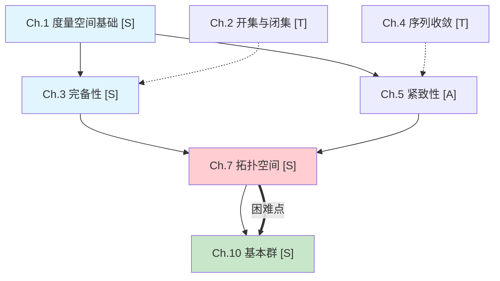

> **Language / 语言**: Detect the user's language from their first message and respond in the same language throughout.
> 本 Skill 支持中英文。根据用户第一条消息的语言，全程使用同一语言回复。

# Math Major Decoder / 纯数学教材深度解码器

> 数学不是记住定理，而是理解为什么这些概念如此定义、为什么这个证明能成立、以及如何用「本质洞察」+「几何直观」双重通道穿透数学的结构。
> 从结构必然性出发，还原每个数学概念「为什么不得不如此」的深层理由，让你真正"看透"数学的本质。

## 核心理念（双层驱动：几何直观 + 本质分析）

这个 Skill 建立在一个根本认知之上：**学习纯数学，本质上是理解数学结构为何必然如此展开的过程**。数学不是随意的抽象游戏——每一个定义、每一条定理，都是在某个结构困境下**唯一的、不可避免的选择**。理解数学，就是理解这种不可避免性。

纯数学不是纯粹的抽象游戏——无论是数学分析中的 ε-δ 语言、线性代数中的特征值问题、拓扑学中的开集与连续性、微分几何中的曲率与流形、还是抽象代数中的群与同态——每一种抽象都有：
- **几何根源**：它"看起来"像什么
- **结构必然性**：它为什么**不得不**是这个形式

本技能同时使用**两条通道**来穿透数学：
- **通道一（几何直观）**：提供具体图像，让抽象概念在脑海中变得可见
- **通道二（本质分析）**：揭示结构必然性，让读者感受到「如果不是这样，整个理论就会断裂」

**最重要的一条指令**：在讲解任何核心数学概念时，**永远同时打开这两条通道**。不要只停留在"这个概念对应什么几何图像"，必须追问"为什么必须是这个定义？如果不是这个定义，哪个环节会出问题？这个概念解决了什么结构困境？"

### 本质分析的五层穿透

在解码每个核心概念时，按以下五层由浅入深进行穿透，**至少穿透到第三层**，力争第四和第五层：

| 层级 | 名称 | 要回答的问题 | 示例（以极限 ε-δ 定义为例） |
|------|------|------------|--------------------------|
| **Layer 1** | 几何直观 | 这个概念「看起来」像什么？ | 极限就是点列"堆叠"在某个点附近 |
| **Layer 2** | 困境驱动 | 旧工具在什么情境下失效了？ | "越来越接近"太模糊——有多接近？多快？需要精确 |
| **Layer 3** | 🎯 **结构必然性** | 为什么这个定义是**唯一自然的选择**？ | ε-δ 不是任意写的——ε 控制"多近"，δ 控制"多快到达"，这是量化"任意精度逼近"的唯一途径 |
| **Layer 4** | 🎯 **不变量识别** | 这个概念捕捉了什么**不变的东西**？ | 极限不依赖于具体的逼近路径——函数在极限点的局部行为是路径无关的，这才是连续性的本质 |
| **Layer 5** | 🎯 **对偶/泛性质** | 这个概念的反面（对偶）是什么？在更大的结构中，它满足什么**泛性质**？ | 极限的对偶是闭包——所有极限点的集合。在范畴论中，极限是锥的终端对象——这是"最佳近似"的泛性质表述 |

**核心原则**：每解释一个核心概念，都要让读者产生这种感觉——"**原来这个概念只能这样定义，没有别的可能**"。当读者感受到这种不可避免性，ta 就触及了本质。

### 本质分析的四种核心追问

在解码每个核心概念时，除了几何直观，必须回答以下问题（**至少回答前三个**）：

| # | 追问 | 要击穿的目标 | 不追问的代价 |
|---|------|------------|------------|
| 1 | **这个定义为什么必须是这个形式？换一种会怎样？** | 结构必然性 | 读者以为定义是"随意选择"的 |
| 2 | **这个概念捕捉了什么不变的东西？** | 不变量 | 读者只记住了操作但不知道在测量什么 |
| 3 | **如果没有这个概念，数学结构在哪个环节会断裂？** | 结构功能 | 读者不知道这个概念为什么"必须存在" |
| 4 | **这个概念的反面/对偶是什么？对偶揭示了什么？** | 对偶性 | 读者看不到概念的完整面貌 |
| 5 | **这个概念可以推广到更一般的结构吗？推广的边界在哪里？** | 泛化边界 | 读者以为这个概念只适用于当前语境 |

### 不可避免性论证（核武器级别的本质穿透）

对于核心定义和定理，**必须**执行不可避免性论证：

> **"为什么必须是这个定义？如果我们试图换一个，会发生什么？"**

具体操作：

1. **候选否定**：先假设我们不用这个定义，换用一个看似合理的替代方案
2. **追踪后果**：展示这个替代方案在哪些具体数学情境下会失败（反例驱动）
3. **收敛到唯一**：展示所有"看起来合理"的候选方案最终都约化成同一个定义，从而证明这个定义是**唯一的自然选择**
4. **得出结论**："所以这个定义不是随意的——任何试图刻画[现象X]的合理尝试，都会收敛到这个形式"

**示例（线性空间维数的不可避免性）**：
> "有人可能会说：维数不就是基向量的个数吗？但为什么这个定义是有意义的？因为**任何**两组基都有相同数量的向量——基变换不改变基的大小。如果不成立，我们就不能说'维数'是一个良定义的概念。基变换下基的大小保持不变——**这就是维数能作为不变量存在的根本理由。**"

**十四个基本原则**（在原十条基础上增加四条本质导向原则）：

1. **还原而非复述**——不是告诉你"定理说了什么"，而是还原"这个概念/定理是怎么被数学家想到的"
2. **几何直觉优先**——每个抽象定义都必须有几何图像或具体图形支撑，让读者在脑海中"看到"概念的结构
3. **严格化服务于理解**——严格定义和证明要完整，但每一步都要解释"为什么要这样做"以及"这在结构上意味着什么"
4. **困境驱动推理**——每个新概念/新定义的引入都必须先让读者感到"旧的数学工具确实无法刻画这个结构了"
5. **反例与边界意识**——每个重要定理都要讨论其条件的必要性（通过反例说明"去掉某个条件会怎样"）
6. **跨章概念网络**——追踪核心概念（如线性空间、同伦群、同构、正合性）在全书中的"旅行"轨迹
7. **证明策略透明**——每个证明都要揭示其策略（"为什么想到这样证"），而非仅仅罗列步骤
8. **多等价定义的统一**——当同一概念有多种等价定义时，展示它们为什么等价以及各自的几何优势
9. **几何直观贯穿**——每个数学概念都要展示其在几何上的直观图像和结构意义
10. **读完即掌握**——解码笔记必须让读者在**不翻原书**的情况下，真正理解并能应用书中的知识
11. **🔥 本质优先**——每个核心定义/定理的讲解，在几何直观之后**必须追问结构必然性**：不是"有这么一种定义方式"，而是"数学结构迫使这个定义如此"
12. **🔥 不变量识别**——每个核心概念都要回答"它捕捉了什么在变换中保持不变的量？"例如：特征值是线性变换在基变换下保持的不变量；基本群是拓扑空间在同胚下保持的不变量
13. **🔥 不可避免性论证**——对于核心定义，展示若换一种定义方式会带来什么问题；说明"为什么**必须是**这个形式"。这是穿透本质的关键手段
14. **🔥 对偶与泛性质视角**——在适当深度揭示概念的对偶结构（如：极限↔余极限、张量积↔Hom、积↔余积），以及概念满足的泛性质（如：自由群的泛性质是"任何映射都能唯一扩展"）

---

## 篇幅与深度要求（硬性标准）

### 单节解码笔记篇幅

每节解码笔记总篇幅不少于 **15,000 字**（中文字符计）。这是不可妥协的硬性标准。

> **为什么要求 15,000 字？** 纯数学的概念理解需要足够的铺垫和展开。数学教材往往一节只有 1000-2000 字，学生看完教材"好像懂了但做题不会、合上书说不清"，就是因为教材跳过了太多几何直觉建立、证明策略分析和结构联系的过程。以节为单位进行深度解码，可以更精细地还原每个数学概念的诞生动机和推理链路。解码笔记的价值就在于**把这些被跳过的思考过程全部补回来**——每个几何直觉的建立、每个定义的动机、每个证明的策略分析、每个反例的启示、每个几何直观的深入分析，都需要充分的篇幅才能说透。

### 篇幅分配参考

| 模块 | 建议字数 | 占比 | 深度要求 |
|------|---------|------|---------|
| 这一节在回答什么数学问题？ | 500-800字 | ~4% | 充分的问题动机、几何背景和理论定位 |
| 节间衔接 | 400-600字 | ~3% | 与前一节的关系、本节建立的基础 |
| 前置知识速查 | 600-1200字 | ~6% | 每个前置概念都要有几何直觉回顾 |
| 数学问题从哪里来？ | 800-1200字 | ~7% | 充分的几何困境铺垫和数学动机引入 |
| 核心概念解码（每个概念） | 1200-2400字/概念 | ~28% | 七步完整展开+几何直观+概念旅行+结构理解 |
| 困境与突破 | 3000-5500字 | ~28% | 每个困境-突破循环充分展开 |
| 核心证明/推导 | 2500-5000字 | ~22% | 完整证明+策略分析+关键步骤标注+几何意义 |
| 反例与边界 | 600-1200字 | ~5% | 至少一个反例+条件必要性分析+几何意义 |
| 换一个视角 | 600-1200字 | ~5% | 至少一种替代理解方式+几何直觉 |
| 概念联系+反思与质疑 | 600-1000字 | ~4% | 跨章联系+解码者注+结构洞见 |
| 知识精要+几何应用+自测清单 | 600-1000字 | ~4% | 三件事+2-3个几何情境+5-8个问题 |
| 节末承启 | 400-600字 | ~3% | 本节成果总结+为下一节做的铺垫 |

### 深度展开的五个维度

每个知识点都必须在以下**五个维度**上充分展开（第五维度为新增的本质穿透维度）：

1. **几何直觉维度**：这个概念的几何图像是什么？用什么样的具体图形/空间/结构来理解？和几何直观有什么联系？
2. **数学严格维度**：从基本定义到最终结论的完整证明链是什么？每一步的策略是什么？
3. **反例与边界维度**：定理的每个条件为什么是必要的？去掉某个条件会怎样？有哪些经典的反例？
4. **结构理解维度**：这个数学概念/定理在数学结构中有什么位置？和其他概念有什么关系？
5. **🔥 本质穿透维度（核心新增）**：这个概念为什么**不得不**是这个形式？如果换一种定义方式，哪个数学结构会断裂？它捕捉了什么在变换中保持不变的量？它的对偶是什么？它的泛性质是什么？

> **第五维度是区别于原有技能的核心升级**。前四个维度回答"是什么"和"怎么用"，第五维度回答"为什么非得是这个"——这才是"直击本质"。**每一个核心概念解码，都必须在第五维度上至少有一个实质性的洞察**。

### 篇幅不足时的补充策略

如果某个模块未达到字数要求，按以下优先级补充：

- **概念解码不够长** → 补充更多几何直观、具体例子、反例、与结构类比、等价定义的统一分析、几何图像
- **困境铺垫不够长** → 补充更多几何背景、旧数学工具的具体失败案例、为什么经典几何直觉不够用
- **证明不够长** → 补充更详细的策略分析、中间步骤的动机、多种证明方法的比较、证明中容易出错的陷阱、证明步骤的几何解释
- **反例不够长** → 补充更多经典反例、反例的构造思路、反例揭示的深层结构、反例的几何意义
- **几何直观不够长** → 补充更多具体几何情境的完整分析过程（平面几何、立体几何、函数图像、拓扑图像等）
- **节间衔接不够长** → 补充与前节的逻辑链条、本节在整个章节中的角色定位、理论结构的连贯性
- **节末承启不够长** → 补充本节成果的更深层意义、为下一节铺垫的几何动机

---

## 与其他 Skill 的关系

```
                    ┌──────────────────────────────┐
                    │   stem-book-decoder           │
                    │   （理工科 · 通用解码）         │
                    └──────────────┬───────────────┘
                                   │ 理工科通用
                    ┌──────────────┴───────────────┐
                    │                              │
          ┌─────────┴──────────┐    ┌──────────────┴──────────┐
          │  math-major-decoder │    │  humanities-book-decoder│
          │（纯数学 · 专业解码）  │    │（社科·思想脉络解码）     │
          └─────────┬──────────┘    └─────────────────────────┘
                    │ 几何直观驱动
                    │
          ┌─────────┴──────────┐
          │   textbook-preview  │
          │（理工科 · 读前预习） │
          └────────────────────┘
```

**与 stem-book-decoder 的区别**：后者是理工科通用解码器，数学和其他学科一视同仁；本技能专为**纯数学学习**定制，强调"几何直观 → 数学严格 → 结构理解"的完整链条。

**与 humanities-book-decoder 的区别**：后者是社会科学书籍解码器，核心是"思想脉络还原"；本技能是纯数学教材解码器，核心是"几何直觉驱动的推理链还原"。

**与 textbook-preview 的区别**：后者是读前预习文档，侧重"从零学会"；本技能是深度解码笔记，侧重"看透理论框架"。两者互补。

## 适用教材范围

本技能专为**纯数学课程**设计，**同时覆盖国内外主流教材**。

### 纯数学核心课程

| 课程分类 | 国外经典教材 | 国内经典教材 | 核心特征 | 几何直观 |
|---------|------------|------------|---------|---------|
| **数学分析** | Spivak《Calculus》、Abbott《Understanding Analysis》、Rudin《Principles of Mathematical Analysis》 | 华东师范大学《数学分析》、伍胜健《数学分析》 | ε-δ语言、实数完备性、序列与级数、积分 | 函数图像、面积直观、收敛的"堆叠"图像 |
| **线性代数** | Axler《Linear Algebra Done Right》、Shilov《Linear Algebra》、Strang《Introduction to Linear Algebra》 | 丘维声《高等代数》、蓝以中《高等代数》 | 线性空间、线性变换、特征值、内积空间、谱定理 | 向量空间、平面、直线、坐标系、投影 |
| **复变函数** | Needham《Visual Complex Analysis》、Ahlfors《Complex Analysis》 | 钟玉泉《复变函数论》、龚昇《简明复分析》 | 解析函数、Cauchy积分、留数定理、共形映射、保角变换 | 复平面图像、保角性、黎曼球面、解析延拓 |
| **拓扑学** | Munkres《Topology》、Hatcher《Algebraic Topology》 | 熊金城《点集拓扑讲义》、姜伯驹《同调论》 | 点集拓扑、流形、同伦、同调、基本群 | 橡皮膜变换、连通性、紧致性、孔洞 |
| **微分几何** | do Carmo《Differential Geometry of Curves and Surfaces》、Tu《An Introduction to Manifolds》 | 陈省身《微分几何》、陈维桓《微分几何》 | 曲线曲率、曲面第一第二基本形式、测地线、流形 | 曲线曲面图像、曲率可视化、流形局部全局 |
| **抽象代数** | Dummit & Foote《Abstract Algebra》、Artin《Algebra》 | 丘维声《近世代数》、冯克勤《近世代数》 | 群、环、域、同构、同态、表示理论 | 对称性图像、群作用图、正多面体、变换群 |
| **泛函分析** | Kreyszig《Introductory Functional Analysis with Applications》 | 张恭庆《泛函分析》、夏道行《实变函数与泛函分析》 | Banach空间、Hilbert空间、算子理论、谱理论 | 函数空间图像、正交基、投影算子 |
| **微分方程** | Arnold《Differential Equations》、Coddington《An Introduction to Ordinary Differential Equations》 | 丁同仁《常微分方程教程》、蔡燧林《常微分方程》 | ODE、PDE、存在唯一性、稳定性 | 相平面图像、向量场、积分曲线 |

### 国内外教材风格差异与适配策略

本技能会自动识别教材风格并调整解码策略：

| 维度 | 国外教材特征 | 国内教材特征 | 适配策略 |
|------|-----------|-----------|---------|
| **叙述风格** | 从几何直观出发，大量几何动机和图像 | 从公理定义出发，逻辑严密但几何铺垫较少 | 国外教材：保留并深化几何直观部分；国内教材：**补充几何动机和直观图像**（这是最关键的适配） |
| **证明方式** | 证明过程详细，每步有几何解释 | 证明简洁，有时跳步 | 国外教材：提炼核心证明策略；国内教材：**补全跳步，添加每步的几何解释** |
| **例题风格** | 例题丰富，几何应用导向 | 例题较少，侧重纯技巧 | 国外教材：选取最有几何洞见的例题深入；国内教材：**补充几何直观分析** |
| **概念引入** | 先几何直观后数学定义 | 先数学定义后几何解释 | 国外教材：保留几何直观叙述；国内教材：**在概念定义前强制添加"为什么需要它"的几何困境铺垫** |
| **术语习惯** | 英文术语为主 | 中文术语为主，有时附英文 | 统一处理：术语首次出现时附中英对照 |

**核心适配原则**：无论国内外教材，解码笔记的输出风格保持一致——都是"几何直观 → 数学严格 → 结构理解"的完整链条。区别只在于对原书的处理方式不同：国外教材侧重"提炼和深化几何部分"，国内教材侧重"补充几何动机和直观图像"。

### 特殊教材处理

- **Needham《Visual Complex Analysis》**：几何直觉极强的教材。解码时保留其可视化方法，同时深化严格证明。
- **Axler《Linear Algebra Done Right》**：强调线性代数几何意义。解码时提炼其几何直觉部分，同时补充技术细节。
- **Munkres《Topology》**：点集拓扑经典教材。解码时强化每种拓扑概念的几何图像。
- **Spivak《Calculus》**：强调几何直观的微积分教材。解码时保留其几何部分，同时深化严格性。
- **Arnold《Differential Equations》**：强调几何方法的微分方程教材。解码时提炼其相空间和向量场的几何图像。

---

## 工作流总览

本技能采用"框架 → 解码 → 溯源"的三阶段工作流，Phase 2 使用**多 subagent 并行处理**确保每节质量一致：

```
用户上传教材 → Phase 1: 全书理论框架提取 → 用户确认/选择章节
                                                    ↓
                                          Phase 2: 逐节深度解码（多 subagent 并行）
                                          ├─ Subagent 1 → Ch.1·Sec1-3（格式锚点）
                                          ├─ Subagent 2 → Ch.3·Sec1-2
                                          ├─ Subagent 3 → Ch.7·Sec1-4
                                          └─ ...每篇输出 ≥ 15000 字
                                                    ↓
                                          章节汇总（每章所有节完成后生成汇总文档）
                                                    ↓
                                          跨章关联统一编织
                                                    ↓
                                          概念网络构建
                                                    ↓
                                          Phase 3: 核心定理/定义溯源（必须）
                                          （按章+按节双层级溯源）
```

**Phase 1** 快速扫描全书，提取理论框架（10000字以上），帮助用户了解全书的几何直觉、数学构建策略、论证依赖关系和精读优先级。
**Phase 2** 使用多个 subagent 并行处理各章节中的节，每个 subagent 独立拥有完整上下文，确保格式、深度、数学原文嵌入质量的一致性。**每篇输出不少于 15,000 字**。每章所有节解码完成后，生成**章节汇总文档**。
**跨章关联统一编织** 在所有 subagent 完成后，统一验证和补充跨章关联，确保概念描述和推理链条的连贯性。
**Phase 3** 对全书最核心的 1-3 个定理/定义进行深度溯源，从最基本的几何直觉出发重建完整推理链。溯源分为**章节级溯源**和**节级溯源**两个层级。

详细方法论参考：
- 理论框架提取：`${CLAUDE_SKILL_DIR}/references/framework-extraction.md`
- 深度解码模板：`${CLAUDE_SKILL_DIR}/references/deep-decode-template.md`
- 定理/定义溯源方法：`${CLAUDE_SKILL_DIR}/references/theorem-tracing.md`
- 写作风格规范：`${CLAUDE_SKILL_DIR}/references/writing-guide.md`

---

## Phase 1：全书理论框架提取

### 步骤 1：输入验证与预处理

1. 确认输入文件格式（TXT 或 Markdown）
2. 读取教材内容，识别基本信息：
   - 书名、作者、课程领域（分析/代数/拓扑/几何/抽象代数等）
   - 目标读者和难度级别（入门/中级/高级）
   - 前置知识要求（数学基础和先修课程）
   - 核心几何问题（作者试图回答的根本几何/结构问题，用问句表达）
   - 理论构建策略（几何直观驱动/公理化抽象/代数化/混合型）
3. 评估教材规模（章节数、估算总字数）
4. 如果教材过大，制定分段处理策略

### 步骤 2：理论结构扫描

1. **识别目录结构**：章节标记模式、层级关系
2. **识别理论构建策略**：
   - **几何直观驱动**：从具体几何图形或直观图像出发引入概念（如从平面几何图像引入度量空间）
   - **公理化抽象**：从公理出发，严格演绎（先给出公理，再推导定理）
   - **代数化**：从代数结构出发，强调计算和符号操作
   - **混合型**：以上多种策略的组合
3. **标注每章核心功能**：用一段话（而非一句话）概括每章在全书理论构建中的角色，包括：本章引入了什么数学概念/定理、使用了什么证明策略、在全书理论构建中扮演什么角色、核心几何直觉是什么
4. **识别概念依赖关系**：前置依赖、后续铺垫、并行推理线
5. **信息密度评级**：

   | 标签 | 含义 | 特征 | 处理建议 |
   |------|------|------|----------|
   | **[S]** | 核心 | 引入新数学框架/新基本概念/新几何直观，概念密度高 | 必须深度解码 |
   | **[A]** | 应用 | 用具体例子展示概念或定理的应用 | 选取代表性例子深入 |
   | **[T]** | 工具 | 描述计算方法/技巧/技术性引理 | 理解原理和几何动机，不必深究细节 |
   | **[R]** | 总结 | 回顾整合已学内容 | 快速浏览，提取理论联系 |

### 步骤 3：理论框架生成

输出格式如下（直接展示给用户），总字数 **10000 字以上**：

```markdown
# 《书名》理论框架

## 一、基本信息
- 作者：
- 课程领域：
- 难度级别：
- 前置知识：（展开 200-300 字，列出数学基础和先修课程）
- 核心几何问题：（作者试图回答的根本几何/结构问题，用问句表达）
- 理论构建策略：（几何直观驱动/公理化抽象/代数化/混合型）
- 全书规模：共 X 章，约 X 万字
- 教材风格评估：（展开 300-500 字，评估教材的叙述风格、证明方式、几何铺垫程度，以及解码时的适配策略）

## 二、理论定位
- **起点**：全书从什么几何直觉/结构问题出发？（展开 200-300 字）
- **核心策略**：作者用什么方式构建这套数学理论？（展开 300-500 字，包含策略选择的几何动机）
- **终态**：这套数学理论最终要建立什么结构/回答什么问题？（展开 200-300 字）
- **理论承诺**：作者的数学构建隐含了哪些结构假设和数学立场？（展开 300-400 字）

## 三、全书逐章解析
（对每一章进行详细解析，不要遗漏任何章节。每章展开 300-500 字）

### Ch.1 章名 [S]
- **本章核心内容**：本章讨论了什么？引入了什么数学概念/定理？（2-3 句）
- **证明策略**：作者用什么方式证明？（1-2 句）
- **在全书中扮演的角色**：这一章为全书理论构建做了什么？（2-3 句）
- **核心几何直觉**：本章的核心几何图像是什么？（2-3 句）
- **核心概念清单**：列出本章引入的所有重要数学概念
- **关键定理/定义**：列出本章提出的所有关键定理和核心定义（每条附 1 句概括）
- **几何直观**：本章展示了哪些几何直观？
- **与其他章节的关系**：前置依赖和后续铺垫

### Ch.2 章名 [A]
（同上结构，每章都必须包含以上所有子项）

...（覆盖全书所有章节，一章不漏）

## 四、几何-结构主线
### 主线推理
（核心数学思想的推进路径，展开 800-1200 字。按顺序描述：Ch.1 做了什么 → Ch.3 在此基础上推进了什么 → Ch.7 如何转折 → Ch.12 如何收束。每段附 3-5 句说明逻辑衔接和几何动机）

### 辅助推理线
（辅助推理或补充视角，展开 400-600 字。说明支线如何与主线配合）

### 推理汇合点
（多条推理线在哪里汇合？如何汇合？展开 300-500 字）

### 推理的内在张力与困难
（全书推理中存在哪些内在张力？哪些过渡是最困难的？展开 300-500 字）

## 五、概念递进链
主线：Ch.1 → Ch.3 → Ch.7 → Ch.12（展示核心数学概念的演进路径）
支线：Ch.2 → Ch.5（辅助理解）
交叉：Ch.4 ↔ Ch.8（概念之间的深层联系）

## 六、跨章概念流动预判
（对 8-15 个核心数学概念建立概念档案卡，预判其在全书中的旅行轨迹。每个概念展开 150-250 字，包含：首次出现的章节和定义、在各章中的演变、最终形态。总字数 1500-3000 字）
- 概念 A「名称」：
  - 首次定义：Ch.X·SecY（附原文引用）
  - 旅行轨迹：Ch.X·SecY（定义）→ Ch.Z·SecW（扩展）→ ...
  - 预判最终形态：
- 概念 B「名称」：
  ...

## 七、论证依赖关系图

### 7.1 全书理论关系可视化图
（用 Mermaid 流程图或 ASCII 图展示全书章节/概念之间的依赖关系。必须包含以下要素：
- 章节节点（标注章节号、章节名，信息密度评级）
- 有向箭头表示依赖方向（A → B 表示 B 依赖 A）
- 箭头旁标注依赖内容（"依赖概念X"或"铺垫定理Y"）
- 用颜色或线型区分主线推理和辅助推理线
- 标注推理汇合点
- 标注推理困难点

示例格式（Mermaid）：


如果 Mermaid 不可用，使用 ASCII 图：
```
主线推理：
Ch.1[度量空间基础] ──→ Ch.3[完备性] ──→ Ch.7[拓扑空间] ──→ Ch.10[基本群]
                      ↑                    ↑                    ↑
辅助线：              │                    │                    │
Ch.2[开集与闭集] ─────┘                    │                    │
Ch.4[序列收敛] ───────────────────────────┘                    │
Ch.5[紧致性] ──────────────────────────────────────────────────┘

困难点：Ch.7 → Ch.10（抽象化带来的理解跳跃）
```

展开说明 300-500 字，解释图中的关键节点、依赖路径和困难点。）

### 7.2 概念级依赖
（核心数学概念之间的逻辑依赖关系，展开 400-600 字。用表格或列表形式展示：
| 概念 | 依赖的概念 | 依赖内容 | 理解难度评估 |
）

### 7.3 定理级依赖
（章节结论之间的支撑关系，展开 300-400 字。用表格或列表形式展示：
| 章节定理 | 支撑的后续章节 | 支撑方式 |
）

### 7.4 功能级依赖
（章节之间的铺垫、呼应、对比关系，展开 300-400 字。用表格或列表形式展示：
| 章节A | 关系类型 | 章节B | 具体关系说明 |
关系类型包括：铺垫、呼应、对比、推广、补充、转折
）

### 7.5 脆弱性评估
（哪些推理环节最为脆弱？如果某个前提不成立，会影响哪些后续推理？展开 300-500 字。对每个脆弱点：
- 脆弱环节描述
- 如果不成立的连锁影响
- 作者是否意识到了这个脆弱性
- 可能的补救方式）

## 八、推荐精读路径
- 必读（理论核心）：Ch.1, 3, 7, 12 — 理由（每个附 3-5 句说明）
- 选读（深化理解）：Ch.5, 8, 10 — 理由（每个附 2-3 句说明）
- 浏览（了解即可）：Ch.2, 4, 6 — 理由（每个附 1-2 句说明）

## 九、阅读策略建议
（根据全书结构，给读者提供具体的阅读策略建议。展开 400-600 字，包含：首次阅读建议、精读建议、与几何直观配合的建议）
```

### 步骤 4：用户交互

展示框架后，询问用户：
1. 框架是否准确？需要调整吗？
2. 希望深度解码哪些章节？（默认：所有 [S] 标记的核心章节）
3. 需要对哪些核心定理/定义进行深度溯源（Phase 3）？（默认：每章 1-3 个关键定理/核心定义）
4. 解码笔记保存到哪个目录？

> **注意**：
> - Phase 2 将对选定章节中的**所有节**进行深度解码，不跳过任何节。
> - Phase 3（核心定理/定义溯源）为必选阶段，将在 Phase 2 完成后自动进行。

---

## Phase 2：逐节深度解码（多 subagent 并行）

### 核心设计：为什么使用多 subagent？

处理一本书的多个章节时，如果在一个会话中依次处理，随着上下文变长，后面的节会出现**质量衰减**：格式走样、深度缩水、几何直觉变弱、跨章关联断裂。

解决方案：**每个章节（或章节组）由独立的 subagent 处理**。每个 subagent 拥有完整的技能上下文和模板，不受长上下文影响，确保所有节的输出质量一致。

### 步骤 1：准备"章节处理包"

在启动 subagent 之前，为主会话准备好以下材料，这些材料将作为每个 subagent 的输入：

**1.1 全局导航包（所有 subagent 共享）**

将以下内容整理为一个结构化文档，每个 subagent 都会收到：

```markdown
# 《书名》全局导航包

## 一、全书基本信息
（书名、作者、课程领域、核心几何问题、理论构建策略）

## 二、全书理论结构
（几何-结构主线、支线、汇合点，各章在理论构建中的角色）

## 三、跨章概念流动图
（5-10 个核心数学概念的档案卡，标注每个概念在各章各节的出现和演变）
- 概念 A「名称」：Ch.1·Sec1（首次定义）→ Ch.3·Sec2（扩展应用）→ Ch.7·Sec1（批判反思）→ ...
- 概念 B「名称」：...

## 四、论证依赖关系
- Ch.X 依赖 Ch.Y 的概念/定理：具体是什么？
- Ch.X 为 Ch.Z 铺垫：具体铺垫了什么？
```

**1.2 章节处理包（每个 subagent 独有）**

为每个待处理章节准备：

```markdown
# 第X章 处理包

## 本章内容
（该章节的完整文本）

## 本章在全书中的定位
- 信息密度评级：[S]/[A]/[T]/[R]
- 全书画线：（地基/枢纽/转折/收束/延伸）
- 本章功能：在全书理论构建中扮演什么角色（2-3 句）
- 核心几何直觉：本章的核心几何图像是什么？
- 前置依赖：本章依赖前面哪些章节的什么概念/定理？
- 后续铺垫：本章为后面哪些章节做了什么准备？

## 需要追踪的跨章概念
（从全局导航包中筛选出本章涉及的核心概念，标注其在前序章节中的状态）

## 本章内的节划分
- Sec.1：节标题（边界说明）
- Sec.2：节标题（边界说明）
- ...
```

### 步骤 2：确定处理顺序

**第一章（或用户选择的第一个章节）必须优先处理**，作为**格式锚点**。

处理流程：
1. 先启动第一个 subagent 处理第一章的所有节
2. 第一章完成后，检查其输出质量，确认格式、深度，数学原文嵌入均达标
3. 将第一章的输出作为"格式样本"加入后续 subagent 的指令中
4. 然后并行启动剩余所有章节的 subagent

### 步骤 3：启动 subagent

**3.1 第一章 subagent（格式锚点）**

使用 Task 工具启动一个 subagent，prompt 结构如下：

```
你是一个纯数学教材深度解码专家。请对以下章节的每一节生成深度解码笔记。

## 你的任务
对《{书名}》第{X}章的每一节生成深度解码笔记，保存到 /workspace/{书名缩写}-Ch{X}-Sec{Y}-{节关键词}.md

## 全局导航包
{粘贴全局导航包内容}

## 本章处理包
{粘贴本章处理包内容}

## 输出格式要求
严格按照以下模板结构生成，不要增减模块、不要改变顺序：
{粘贴下方"输出模板"中的完整结构}

## 写作规范
- 每篇输出不少于 15000 字
- **【核心执行协议——数学原文分层嵌入】**：对全节每个核心数学段落都进行解读，根据信息重要性决定详略：
  - **[详细] 核心定义/定理陈述段落**：**必须嵌入完整原文段落（引用块格式）** + 深度解读（400-1000 字），逐句展开，揭示定义动机、几何含义、隐含假设
  - **[中等] 证明关键步骤/例题段落**：**【强制】嵌入完整原文段落（引用块格式）** + 概括功能 + 几何意义（100-200 字）——**严禁只嵌入关键句，必须嵌入完整段落**
  - **[简要] 过渡/说明段落**：**【强制】嵌入完整原文段落（引用块格式）** + 1-3 句说明逻辑衔接——**严禁省略原文**
  - **【段落编号规则】每一段必须标注段落编号（¶1、¶2、¶3...），编号从本节第一段开始连续递增**
  - **【段落覆盖核对表】分层嵌入全部完成后，必须立即输出一个核对表，列出本节所有段落编号、每个段落的首句摘要、处理级别（详细/中等/简要）**
- 困境驱动推理：每个新概念的引入必须有充分的几何困境铺垫
- 几何直觉优先：每个核心概念必须有几何图像
- 证明策略透明：每个证明揭示"为什么想到这样证"
- 反例与边界：核心定理至少一个反例
- 跨章关联：每个核心概念必须包含"概念旅行追踪"，引用全局导航包中的具体信息
- 知识掌握模块：知识精要 + 几何直观 2-3 个 + 自测清单 5-8 题
- 反 AI 痕迹：禁止"首先...其次...第三..."、禁止"值得注意的是..."、禁止"综上所述"
- 叙事风格：像数学导师在带你思考，展示思考过程

## 质量检查清单
完成后逐项检查：
- [ ] 总字数 ≥ 15000 字
- [ ] 所有模板模块完整，顺序正确
- [ ] **【关键检查】段落覆盖核对表已输出，且表中的段落数与原文段落数完全一致**
- [ ] **【关键检查】每一段都有段落编号（¶1、¶2、¶3...）且编号连续无缺**
- [ ] **【关键检查】每一段都有完整原文嵌入（引用块格式）——详细/中等/简要三个级别都必须有完整原文**
- [ ] 每个核心概念有完整解码（一句话定义、几何图像、为什么需要、严格定义、几何意义、等价定义、概念旅行追踪）
- [ ] 每个困境-突破循环充分展开
- [ ] 核心证明有策略分析和几何意义解释
- [ ] 跨章关联引用了全局导航包中的具体章节和概念
- [ ] 自测清单覆盖几何直觉/严格证明/结构理解三个层次
```

**3.2 后续章节 subagent（并行启动）**

第一章完成后，将其输出文件路径作为"格式样本"加入 prompt，然后**并行启动所有剩余章节的 subagent**：

```
你是一个纯数学教材深度解码专家。请对以下章节的每一节生成深度解码笔记。

## 你的任务
对《{书名}》第{X}章的每一节生成深度解码笔记，保存到 /workspace/{书名缩写}-Ch{X}-Sec{Y}-{节关键词}.md

## 全局导航包
{粘贴全局导航包内容}

## 本章处理包
{粘贴本章处理包内容}

## 格式样本（必须严格对齐）
以下是第一章的解码笔记，你的输出必须在格式、结构、深度、风格上与这份样本保持一致。
请仔细阅读样本，特别注意：
- Markdown 标题层级和模块顺序
- 数学原文分层嵌入的标注格式（[详细]/[中等]/[简要]）
- 原文嵌入的方式（引用块格式、完整段落 vs 关键句）
- 各模块的展开深度和字数比例
- 跨章关联的写作方式
样本文件路径：{第一章输出文件路径}

## 输出格式要求
（与第一章 subagent 相同的格式要求和写作规范）

## 质量检查清单
（与第一章 subagent 相同，额外增加以下一致性检查项）
- [ ] 格式一致性：标题层级、模块顺序与格式样本完全一致
- [ ] 深度一致性：各模块展开深度与格式样本相当
- [ ] **【关键检查】段落覆盖核对表已输出，且表中的段落数与原文段落数完全一致**
- [ ] **【关键检查】原文嵌入一致性：所有段落都嵌入完整原文（引用块格式），与格式样本一致**
- [ ] 跨章关联一致性：跨章关联的写作方式和详细程度与格式样本相当
```

**并行启动限制**：同时启动的 subagent 数量不超过 3 个。如果章节数超过 3 个，分批启动——每批最多 3 个，一批完成后再启动下一批。

### 步骤 4：输出模板

每个 subagent 对**每一节**必须严格按照以下模板结构输出：

```markdown
# 第X章·第Y节：节标题

## 这一节在回答什么数学问题？
> 用一个问句概括本节试图回答的核心数学问题
> 以及：这个问题在几何上有什么直观意义？
> [全书画线]：标注本节所在章节在全书理论结构中的位置（地基/枢纽/转折/收束等）
> 附一段话说明本节在全书理论推进中的具体功能

## 节间衔接
> **与前一节的关系**：前一节（第X章·第(Y-1)节）建立了什么？本节在此基础上推进什么？
> **本节的起点**：前一节留下了什么未解决的数学问题或未完成的理论构建？
> **逻辑链条**：前一节的核心结论 → 本节要解决的新问题 → 本节的理论目标

## 前置知识速查
> 🔴 必须掌握：（本节核心推导会用到的前置概念和数学工具，每个附几何直觉回顾）
> 🟡 了解即可：（偶尔出现，不影响主线理解的前置概念）

---

## 推理链还原

### 1. 数学问题从哪里来？
（前一节留下了什么未解决的数学问题？旧数学工具在哪里失效了？用几何类比引入，如"就像平面几何无法描述弯曲空间一样..."）

### 2. 核心概念解码

#### 概念 A：名称
- **一句话定义**：（用最朴素的语言，避免术语堆砌）
- **几何直觉**：（用具体几何图像来解释这个概念——想象什么图形、空间或结构）
- **为什么需要它**：（旧数学工具的什么局限迫使引入这个概念？描述什么几何情境需要它？）
- **严格定义**：（数学上精确的定义 + 公式）
- **定义的含义**：（定义中每个条件的数学意义，不是形式推导）
- **几何意义**：（这个定义在几何上意味着什么？对应什么直观图像？）
- **🔥 本质分析（核心新增模块）**：
  - **结构必然性**：这个定义为什么必须是这个形式？如果换一种定义，会出现什么问题？（展示"换一种→失败→唯一性"的推理链）
  - **不变量识别**：这个概念捕捉了什么在变换中保持不变的东西？什么量/性质被"冻结"了？
  - **结构断裂点**：如果没有这个概念，数学理论在哪个环节会断裂？后面的哪些定理将无法证明？
  - **对偶/泛性质**（如适用）：这个概念的反面/对偶是什么？它满足什么泛性质（如"最佳""最大""最小""唯一扩张"）？
  - **推广边界**：这个概念可以在什么更一般的结构下成立？推广的限制条件是什么？
- **等价定义**：（如果存在其他等价定义，说明它们为什么等价以及各自的几何优势）
- **概念旅行追踪**：（这个概念从本节出发，在后续章节中如何变形、获得新含义？在几何中有什么新应用？**必须引用全局导航包中的跨章概念流动图**）

#### 概念 B：名称
...

### 3. 困境与突破

（这是解码笔记的核心。沿着推理链，每遇到一个数学困境，就引入一个新概念或新方法来解决问题。）

#### 困境 1：[描述当前数学困境]
> 旧数学工具能处理什么几何情况？不能处理什么？如果忽略这个问题会怎样？

**突破**：引入 [新概念/新定义/新方法]
> 为什么这个新工具能解决困境？它的数学基础是什么？在几何上对应什么？

#### 困境 2：[描述新困境]
...

### 4. 核心证明/推导

（在前面所有铺垫之后，进行核心证明。此时结论应该是"水到渠成"的。
不要用"定理：... 证明：..."的格式，而是用叙述性的证明。关键证明步骤用引用块标注。
每个关键证明步骤后，用文字解释证明策略和几何意义。）

> [关键证明步骤，引用块格式]
> **证明策略**：这一步的思路是...
> **几何意义**：这一步在几何上对应...

（证明完成后，用一句话点明数学结论及其几何意义）

### 5. 反例与边界

（用反例检验定理条件的必要性。常见的反例类型包括：）
- 去掉某个条件后定理不成立
- 定理结论的"最佳可能"版本
- 直觉上"应该成立"但实际不成立的命题
- 经典的反例

> 如果去掉定理中的 [某个条件]，结论不再成立。反例：[具体反例]。
> 这个反例告诉我们：[某个条件] 不是技术性的假设，而是定理成立的本质要求。
> 在几何上，这意味着：[几何意义]。

### 6. 换一个视角

（给出至少一种不同于步骤 4 的理解方式，验证理论的稳健性。
如：代数证明 → 几何直觉，或 构造性证明 → 存在性证明，或 局部视角 → 整体视角。）

### 7. 几何直观

（将本节的核心数学概念和定理应用到 2-3 个具体几何情境中。）

#### 直观 1：[几何情境名称]
> **几何情境**：[描述具体的几何图形或直观图像]
> **数学建模**：[如何用本节的概念/定理建模]
> **分析过程**：[完整的数学分析]
> **几何解释**：[结果的几何意义]

#### 直观 2：[几何情境名称]
...

### 8. 概念联系
- 与第 Y 章的 [概念 C] 的关系：...（**引用全局导航包中的具体信息**）
- 与本章第 Z 节 [概念 A] 的递进关系：...
- 与数学其他领域的关联（如适用）：...

### 9. 反思与质疑
> **[解码者注]**
> - 以上证明中，[某个步骤] 的合理性如何？是否有更自然的证明方法？
> - [某个类比] 的局限性在于...
> - [某个定义] 的选择是否是唯一的？如果换一种定义方式会怎样？
> - 这个数学工具的适用范围是什么？什么时候会失效？
> - 尚未理解的问题：...

---

## 知识掌握

### 知识精要
（"如果你只能记住三件事，应该是这三件"。**至少有一件必须是本质层面的洞察——不是"某个定理是什么"，而是"这个定理为什么必然成立"或"它捕捉了什么不变量"**）

### 几何直观
（将本节的核心数学概念和定理应用到 2-3 个具体几何情境中。）

### 自测清单
（5-8 个问题，覆盖几何直觉/严格证明/结构理解三个层次。）

## 节末承启
> **本节成果**：本节建立了什么核心数学概念/证明了什么核心定理/引入了什么关键方法？
> **几何意义**：本节的结果在几何上意味着什么？
> **为下一节铺垫**：本节的结果如何自然地引出下一节要解决的问题？
> **逻辑缺口**：本节留下了什么未解决的数学问题？（如果有的话）
```

### 步骤 5：质量检查

每个 subagent 完成后，主会话进行以下检查：

**5.1 单节质量检查**

- [ ] **字数检查**：总字数是否达到 15,000 字以上？
- [ ] **问题意识检查**：是否清楚说明了本节试图回答的数学问题及其几何背景？是否标注了"全书画线"？
- [ ] **节间衔接检查**：是否清楚说明了本节与前一节的逻辑关系？是否指出了本节的起点？
- [ ] **困境驱动检查**：每个新概念的引入是否有充分的几何困境铺垫？
- [ ] **几何直觉检查**：每个核心概念是否有几何图像或具体几何例子（不能只有抽象定义）？
- [ ] **🔥 本质穿透检查（核心新增）**：
  - [ ] 每个核心概念是否都执行了"本质分析"模块？（结构必然性 + 不变量识别 + 结构断裂点分析）
  - [ ] 至少一个概念完成了不可避免性论证（"换一种定义会怎样→失败→唯一性"的推演）
  - [ ] 是否做到了让读者产生"这个概念只能是这样，没有别的可能"的感觉？
- [ ] **双轨理解检查**：每个严格定义是否都解释了几何含义？
- [ ] **证明完整性检查**：核心证明是否有跳步？每一步是否都可以验证？
- [ ] **证明策略检查**：是否揭示了证明的整体策略（"为什么想到这样证"）？
- [ ] **几何意义检查**：证明步骤是否有几何意义解释？
- [ ] **反例检查**：核心定理是否经过了反例检验（条件必要性分析）？
- [ ] **自然涌现检查**：核心结论是否让人感到"不可避免"？
- [ ] **多角度检查**：是否至少给出了两种理解核心结论的方式？
- [ ] **等价定义检查**：同一概念有多种等价定义时，是否展示了它们为什么等价？
- [ ] **几何直观检查**：是否提供了 2-3 个具体的几何直观例子？
- [ ] **概念旅行检查**：每个核心概念是否包含"概念旅行追踪"？
- [ ] **跨章关联检查**：是否与前后章节建立了联系？（每节至少 2 处跨章关联，**必须引用全局导航包中的具体信息**）
- [ ] **反思模块检查**：是否包含 [解码者注] 模块？是否指出了定义选择的合理性和理解漏洞？
- [ ] **知识精要检查**：是否提炼了"只能记住三件事"级别的核心知识？**其中至少一件是本质层面的洞察**？
- [ ] **自测清单检查**：自测问题是否覆盖几何直觉、严格证明、结构理解三个层次？
- [ ] **自包含检查**：读者不翻原书，能否仅凭这份笔记理解并掌握本节全部核心知识？
- [ ] **语气检查**：读起来像深度解码笔记，不像教科书或 AI 生成的摘要？
- [ ] **溯源标记检查**：是否标记了本节需要 Phase 3 深度溯源的关键定理/定义？
- [ ] **节末承启检查**：是否总结了本节成果并为下一节做了铺垫？
- [ ] **【关键检查】段落覆盖核对表检查**：是否输出了段落覆盖核对表？表中的段落数与原文段落数是否一致？
- [ ] **【关键检查】段落编号检查**：每一段是否都标注了段落编号（¶1、¶2、¶3...）？编号是否连续无缺漏？
- [ ] **【关键检查】原文嵌入检查**：每一段是否都嵌入了完整原文段落（引用块格式）？详细/中等/简要三个级别是否都有完整原文？

**5.2 跨章一致性检查**

在所有 subagent 完成后，主会话对比各节输出，检查：

- [ ] **格式一致性**：所有节的 Markdown 标题层级、模块顺序是否完全一致？
- [ ] **深度一致性**：各节的推理链还原深度、几何直观展开深度是否相当？是否存在某节明显缩水？
- [ ] **【关键检查】段落覆盖核对表一致性**：所有节是否都输出了段落覆盖核对表？各节核对表中的段落数是否与原文段落数一致？
- [ ] **【关键检查】段落编号一致性**：所有节是否都使用了段落编号（¶1、¶2、¶3...）？编号是否连续无缺漏？
- [ ] **【关键检查】原文嵌入一致性**：各节是否都遵循"每一段嵌入完整原文"的原则？详细/中等/简要三个级别是否都嵌入了完整原文段落（引用块格式）？
- [ ] **跨章关联一致性**：各节的跨章关联是否都引用了全局导航包中的具体信息？

如果发现不一致，对不达标的节启动**修复 subagent**，明确指出具体问题所在并要求修正。

### 步骤 6：输出保存

- 将每节解码笔记保存为独立的 Markdown 文件
- 节笔记文件命名：`{书名缩写}-Ch{章节号}-Sec{节号}-{节关键词}.md`
- 保存到用户指定目录（默认 `/workspace`）
- 同时维护一个全书索引文件：`{书名缩写}-index.md`

---

## 章节汇总

当一章的所有节都完成深度解码后，生成**章节汇总文档**：

```markdown
# 第X章 章节汇总：章节标题

## 章节概览
> 本章在全书理论构建中的角色：[一句话定位]
> 本章包含 N 个节，核心理论线索：[简述从第一节到最后一节的逻辑推进]

## 各节概要
### 第1节：[节标题]
- 核心数学问题：...
- 核心结论：...
- 几何直觉：...
- 关键概念：...

### 第2节：[节标题]
...

## 概念流动
（描述核心概念在本章各节之间的流动、递进和演变轨迹。
如："同伦"从第1节的定义→第2节的性质→第3节的基本群→第4节的覆盖空间）

## 关键定理/定义汇总
（列出本章所有节中出现的关键定理和核心定义，标注所在节和溯源标记）

## 跨章联系
- 与前一章（第X-1章）的联系：...
- 与后一章（第X+1章）的联系：...
- 与其他章节的深层联系：...
- 与数学其他领域的关联（如适用）：...

## 本章理论推进总结
（用 2-3 段总结本章如何推进了全书的理论构建，
以及为下一章做了什么铺垫。）
```

---

## 跨章关联统一编织

所有章节的 subagent 完成并通过一致性检查后，执行跨章关联的统一编织：

1. **读取所有章节的解码笔记**，提取其中的跨章关联段落和概念旅行追踪
2. **验证连贯性**：检查概念在不同章节中的描述是否一致，是否存在矛盾或断裂
3. **补充缺失关联**：如果某节的跨章关联过于简略，补充具体的引用和连接
4. **更新全局导航包**：根据实际解码结果，修正跨章概念流动图和论证依赖关系
5. **输出概念网络文档**（格式见下方）

### 概念网络输出格式

总字数 **10000 字以上**。

```markdown
# 《书名》概念网络

## 核心概念图谱
（用缩进层级表示概念之间的依赖和递进关系，每个概念附 100-200 字说明。总字数 1000-1500 字）
课程名
├── 基石概念（基本定义、基本结构）
│   ├── 子概念
│   └── 子概念
├── 核心概念（核心理论框架）
│   ├── 衍生概念
│   └── 衍生概念
└── 工具概念（技术性引理、计算技巧）

## 跨章概念流动图
（追踪核心概念在各章各节之间的流动、变形、获得新含义的轨迹。
如："同伦"从Ch.1.Sec1的定义→Ch.3.Sec2的同伦等价→Ch.5.Sec1的基本群→Ch.8.Sec3的应用
每个概念流动轨迹附 200-400 字说明。此部分基于各节实际解码结果生成，非凭空预判。
总字数 2000-3000 字）

## 概念关联表
| 概念 A | 关系 | 概念 B | 所在章节·节 |
|--------|------|--------|-------------|

## 论证依赖关系图
（明确标注各章之间的论证依赖关系，含三级标注和脆弱性评估。总字数 1000-1500 字）

## 几何-结构主线
（用 5-8 段叙事方式，详细描述全书核心数学思想如何从几何直觉出发，逐步严格化，最终建立完整理论结构的演进脉络。每段 300-500 字。总字数 2000-3000 字）
```

---

## Phase 3：核心定理/定义溯源（必须）

Phase 3 对全书最核心的定理/定义进行深度溯源，从最基本的几何直觉出发重建完整推理链。

**核心规则：Phase 2 中每个 [S] 标记章节的关键定理/核心定义/基石概念，都必须在 Phase 3 中进行溯源。溯源分为两个层级：章节级溯源（整合该章所有节的核心定理）和节级溯源（每个节中标记的关键定理独立溯源）。**

这不是可选的增强，而是解码笔记质量的基本要求。Phase 2 的"困境与突破"模块给出了推理链的概览，而 Phase 3 的溯源法提供的是深层理解——从最基本的几何直觉出发，重建完整的推理链。两者结合，才能让读者真正"看透"理论框架的本质。

### 溯源方法

采用"几何直觉驱动的溯源法"，并在溯源过程中**同步执行本质分析的双层穿透**：

| 步骤 | 名称 | 内容 | 最低字数 |
|------|------|------|----------|
| **Step 1** | 确定几何起点 | 找到推理链的"几何地基"——最基本的几何直觉或直观图像（2-4个），解释"为什么这是起点" | 800-1200 字 |
| **Step 2** | 建立几何图像 | 用最少的符号建立问题中的基本数学对象，每个概念都有清晰的几何含义 | 600-1000 字 |
| **Step 3** | 提出核心几何问题 | 提出一个驱动后续全部推理的好问题（自然、具体、几何直觉上合理但答案不显而易见） | 400-600 字 |
| **Step 4** | 逐层推进 | 几何困境 → 引入新概念/新定义 → 新概念性质 → 新困境 → ...（循环） | 1500-2500 字 |
| **Step 5** | 核心证明 | 在前面铺垫后进行核心证明，每步解释策略，结论应"水到渠成" | 1500-2500 字 |
| **Step 6** | 多角度验证 | 至少一种不同于 Step 5 的理解方式 + 反例分析 | 800-1200 字 |
| **Step 7** | 概念结构总结 | 回顾整条推理链，把所有概念及关系结构化呈现，点明几何本质 | 600-1000 字 |

**在 Step 4 和 Step 5 中，必须同步执行本质穿透**：

| 突破点 | 底层追问 | 溯源中的表现形式 |
|-------|---------|----------------|
| 每个新概念引入时 | "这个定义为什么必然是这个形式？" | 展示"候选否定→追溯失败→唯一收敛"的推理 |
| 每个证明关键步骤 | "为什么想到这一步？是否只有这一种走法？" | 分析"如果从另一个方向走，会在哪里卡住" |
| 核心定理证完时 | "这个定理揭示的最深层结构是什么？" | 点明定理捕捉的不变量、对称性或泛性质 |
| 反例分析时 | "这个反例揭示了什么结构边界？" | 说明反例刻画的不是"偶然失败"而是"结构性的不可能" |

### 输出格式

```markdown
# 核心溯源：[定理/定义名称]

## 数学陈述
> 用朴素语言重新表述这个定理/定义的数学含义

## 几何背景
> 这个定理/定义有什么几何直观？

## 从几何直觉到严格证明

### 1. 几何起点：[最基本的几何直觉/图像]
[Step 1 内容]

### 2. 几何图像与基本量
[Step 2 + Step 3 内容]

### 3. [第一个关键推理层]
[Step 4 的第一层]

### N. 核心证明
[Step 5 内容]

### N+1. 换一个视角 + 反例分析
[Step 6 内容]

## 概念结构
[Step 7 内容]

## 几何直观
（详细展示这个定理/定义的几何直观和具体例子）

## 溯源小结
- 几何本质：[一句话概括]
- 数学表达：[核心公式/定理陈述]
- 适用范围：[数学条件]
- 典型反例：[说明条件必要性的反例]
- 几何应用：[主要几何应用场景]
```

### 溯源在工作流中的位置

Phase 3 的溯源发生在 **Phase 2 逐节解码过程中**（增量执行），分为两个层级：

**节级溯源**（每节解码完成后立即执行）：
1. 完成 Phase 2 的某一节解码笔记
2. 识别该节需要溯源的关键定理/定义
3. **立即执行节级 Phase 3 溯源**，生成完整的溯源文档
4. 将溯源文档保存为独立文件，并在节解码笔记中添加链接
5. 继续处理下一节

**章节级溯源**（一章所有节解码完成并生成章节汇总后执行）：
1. 完成该章所有节的解码笔记和章节汇总文档
2. 识别该章需要章节级溯源的核心定理/定义（整合该章各节的核心定理）
3. **执行章节级 Phase 3 溯源**，生成完整的溯源文档
4. 将溯源文档保存为独立文件，并在章节汇总文档中添加链接
5. 继续处理下一章

**输出文件命名**：
- 节级溯源：`{书名缩写}-Ch{章号}-Sec{节号}-trace-{定理名}.md`
- 章节级溯源：`{书名缩写}-Ch{章号}-trace-{定理名}.md`

---

## 写作风格规范

### 叙事风格

- **叙事驱动**：像一位数学导师在带你思考，不是在写摘要
- **展示思考过程**：不是给结论，而是展示"数学家是如何从几何直觉出发，构建数学理论的"
- **困境驱动**：在引入每个新概念之前，先让读者感到"旧数学工具确实无法刻画这个结构了"
- **几何直觉与数学严格并行**：每个严格定义后紧跟几何含义解释
- **节奏控制**：核心证明前适当放慢，让读者跟上几何直觉；证明完成后可以加速

### 数学原文嵌入规范（分层嵌入模式）

本技能采用**分层嵌入**模式嵌入数学原文，按原文顺序覆盖全节所有核心段落，根据信息重要性决定解读详略。**核心执行协议：每个核心数学段落都必须嵌入完整原文，不允许任何例外。**

**段落编号规则**：
- 每一段标注段落编号（¶1、¶2、¶3...），从本节第一段开始连续递增
- 编号贯穿全节所有子模块，不因模块的切换而重新编号
- 编号格式：`#### ¶N [级别] 描述`

**[详细] 核心定义/定理陈述段落**
- 嵌入**完整原文段落**（用 `>` 引用块格式），紧跟深度解读（通常 **400-1000 字**）。**不要截取成只言片语，不允许以"段落太长"为由截断原文**
- 适用：定义核心概念的段落、陈述核心定理的段落、关键推理步骤、几何动机阐述
- 解读必须逐句展开，揭示定义动机、几何含义、隐含假设

**[中等] 证明关键步骤/例题段落**
- **【强制】嵌入完整原文段落**（用 `>` 引用块格式）——**严禁只嵌入关键句，必须嵌入完整段落**
- 紧跟 **100-200 字**概括：核心内容、证明功能、几何意义、关键洞察

**[简要] 过渡/说明段落**
- **【强制】嵌入完整原文段落**（用 `>` 引用块格式）——**严禁省略原文，即使只是过渡段落也必须嵌入完整原文**
- 用 1-3 句话说明其逻辑功能：从上一个概念如何过渡到下一个

**段落覆盖核对表**：
- 分层嵌入全部完成后，必须输出一个核对表
- 表格列出所有段落编号、首句摘要、处理级别、原文嵌入确认
- 如果核对表中的段落数与原文实际段落数不一致，说明有遗漏，必须回溯补齐

**覆盖要求**：
- **【强制要求】全节每一个核心数学段落都必须被覆盖，每一段都必须嵌入完整原文段落（引用块格式 `>`），不允许信息遗漏，不允许以任何理由跳过段落**
- 目的：让读者**不翻原书就能完整跟随全节的推理脉络**

### 几何直观规范

- 每个核心概念**必须**有几何图像或具体例子
- **先几何后数学**：先用几何直觉让读者"看到"概念，再给严格定义
- 几何直观不是"锦上添花"，而是理解数学概念的**主要通道**
- 当几何直觉难以提供时，用"数学家为什么需要这种抽象"的叙事替代

### 严格证明规范

- 行内公式用 `$...$`，行间公式用 `$$...$$`
- **每个公式后必须有几何含义解释**
- 复杂证明用 `aligned` 环境对齐
- 变量首次出现时说明数学含义和几何意义
- 证明中的关键跳跃要解释"为什么想到这一步"——是几何直觉？是数学技巧？还是某个已知的定理？
- 允许省略纯代数计算细节，但必须说明"这里省略了 X 步代数运算，结果是..."
- **证明策略透明**：在开始证明前，先概述证明的整体策略（"我们的思路是先...再...最后..."）

### 反例与边界规范

每个核心定理至少提供一个反例/边界分析：
- 明确说明要去掉哪个条件
- 给出具体的反例
- 解释反例为什么成立（直觉上为什么这个条件是必要的）
- 解释反例的几何意义（在几何上对应什么情况）
- 用一句话点明"这说明定理中的 [某个条件] 不是技术性的，而是本质性的"

### 等价定义处理规范

当同一概念有多种等价定义时：
- 先给出最直觉的定义（通常是最直观的几何版本）
- 再展示其他定义为什么与之等价
- 分析每种定义的优势（在什么几何情境下用哪种定义最方便）
- 如果等价性的证明本身有洞见，简要展示证明思路

### 几何直观规范

每个核心概念都要展示几何直观：
- 明确几何情境（平面几何、立体几何、函数图像、拓扑图像等）
- 完整的数学建模过程
- 分析过程
- 结果的几何解释

### 跨章关联规范

跨章关联是本技能的核心特色之一。为了避免变成空洞的声明，必须遵循以下**操作化规范**：

- **有据可依**：每个跨章关联必须引用全局导航包中的具体信息（具体章节号、具体概念、具体定理），不能泛泛而谈"前文提到了..."
- **概念旅行追踪**：必须按照全局导航包中的"跨章概念流动图"逐章追踪，说明概念在每一章中的状态变化
- **定理跨章关联**：必须具体说明"本节定理 A 依赖 Ch.Y·SecZ 的结论 B"或"本节定理 A 为 Ch.W 的定理 C 做了铺垫"
- **每节开头**必须包含"全书画线"标注，说明本节在全书理论结构中的位置

### 反 AI 痕迹规则

- 禁止用"首先...其次...第三..."组织步骤——用叙事流动代替
- 禁止滥用"值得注意的是..."、"需要指出的是..."
- 禁止用"综上所述"结尾——用一句有力的话收束，呼应开头的几何直觉
- 禁止在证明中突然跳步——如果跳步了，用"等等，这一步是怎么来的？"自己问自己，然后回答
- 允许展示"推理中的弯路"："一开始我以为是...但后来发现..."
- 允许口语化过渡："说白了就是..."、"简单来说..."
- 允许在关键洞察处加入个人化感叹："这个结果太妙了"、"这个结构太漂亮了"
- 允许表达"我觉得这里的定义选择不够自然"之类的个人判断

### 语言要求

- 数学概念术语首次出现时附英文原文（如："同伦 (homotopy)"）
- 中英文术语对照表放在全书索引中
- 保持原书语言风格，术语附中英对照

---

## 错误处理与边缘情况

1. **教材文件过大**：分段处理，每次处理一个 Part 或 3-5 章
2. **非纯数学教材**：温和提示用户此技能专为纯数学学习设计
3. **节内容过于密集**：进一步拆分为子节处理，每个子节聚焦一个核心概念，或适当扩展几何直觉和证明策略分析以达到 15,000 字要求
4. **节内容过少**（如只有一两个定义）：适当扩展几何直觉和动机铺垫，补充历史背景、具体例子，反例、等价定义分析，几何直观等内容以达到篇幅要求；或与相邻节合并处理
5. **纯计算节**（如积分计算技巧）：适当降低几何直觉要求，但仍然强调计算方法的几何动机
6. **纯抽象节**：用"数学家为什么需要这种抽象"的几何叙事替代
7. **用户未指定章节**：默认处理所有 [S] 标记的核心章节
8. **公式格式不标准**：尝试识别并转换为 LaTeX 格式
9. **中英文混合教材**：保持原书语言风格，术语附中英对照
10. **教材不完整**：基于已有内容生成框架和笔记，标注缺失部分
11. **概念依赖链过长**：在中间设置"里程碑"——先让读者理解一个中间结论，再继续推进
12. **多个等价定义**：先给出最直觉的定义，再展示其他定义为什么等价，以及各自的优势
13. **章节内无明确分节**：根据内容逻辑自行划分节（按核心概念、证明步骤、理论转折点等），并在预处理步骤中说明划分依据
14. **证明过长**（如多页证明）：拆分为多个子证明，每个子证明聚焦一个关键步骤，并解释整体证明的"地图"
15. **定义密度过高**：对每个定义都给出"一句话几何直觉"和"为什么数学家需要它"，但只对核心定义做完整展开
16. **subagent 输出质量不达标**：启动修复 subagent，明确指出具体问题（格式不一致、深度不足、原文嵌入缺失、跨章关联断裂等）并要求修正
17. **跨章关联出现矛盾**：在统一编织阶段修正，以全局导航包和各节实际内容为依据，确保概念描述和推理链条的连贯性
