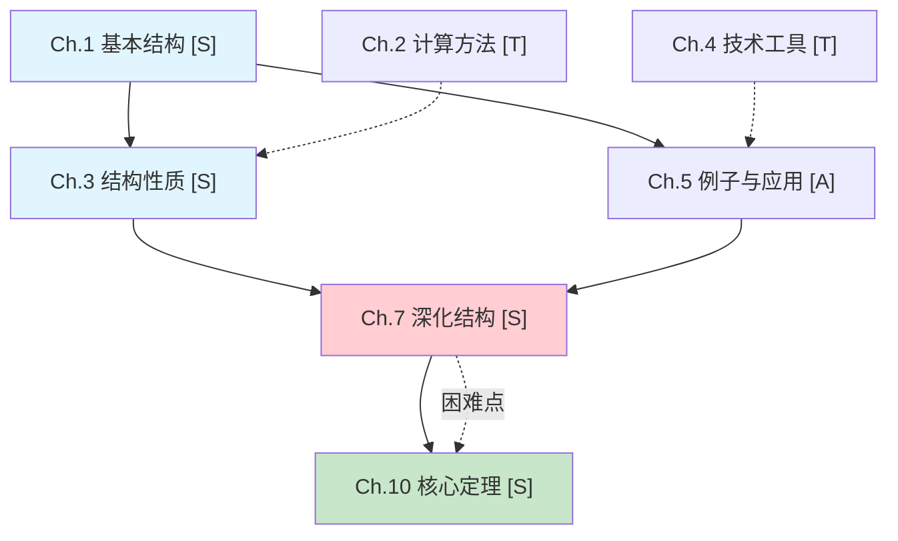

# 理论框架提取方法论

本指南详细说明如何从纯数学教材中提取理论框架，适配多 subagent 并行处理工作流。

---

## 1. 输入验证与预处理

### 1.1 文件格式确认

支持的文件格式：
- TXT 纯文本
- Markdown (.md)
- 直接粘贴的章节内容

### 1.2 基本信息提取

从教材中提取以下信息：

```markdown
## 基本信息
- **书名**：
- **作者**：
- **课程领域**：（数学分析/线性代数/复变函数/拓扑学/微分几何/抽象代数等）
- **难度级别**：（入门/中级/高级）
- **前置知识**：（需要掌握的基础概念和理论）
- **核心几何问题**：（本书试图回答的核心几何/结构问题，用问句表达）
- **理论构建策略**：（几何直观驱动/公理化抽象/代数化/应用导向/混合型）
```

### 1.3 教材规模评估与 Subagent 规划

评估指标：
- 总章节数
- 估算总字数
- 平均每章字数
- 平均每节字数

**分段与并行处理策略**：
- 如果教材超过 500 页或 30 章，建议分段处理
- 每次处理一个 Part 或 3-5 章
- 为 subagent 并行处理做准备：估算每章的节数，规划 subagent 分配
- **并行限制**：同时启动的 subagent 不超过 3 个

---

## 2. 理论结构扫描

### 2.1 目录结构识别

识别章节标记模式：

| 标记类型 | 示例 | 处理方式 |
|---------|------|---------|
| 中文章节 | "第一章"、"第1章" | 识别为 Chapter |
| 英文章节 | "Chapter 1"、"Ch. 1" | 识别为 Chapter |
| 数字标记 | "1."、"1.1"、"1.1.1" | 识别层级关系 |
| Markdown | "#"、"##"、"###" | 识别层级关系 |

**层级关系**：
- Part/篇 → Chapter/章 → Section/节 → Subsection/小节

### 2.2 理论构建策略识别 + 本质分析策略识别

识别教材的理论构建策略，**同时识别该理论中核心概念的本质分析方向**：

| 构建策略 | 特征 | 本质分析重点 |
|---------|------|------------|
| 几何直观驱动 | 从具体几何图形或直观图像出发引入概念；强调几何洞察和视觉理解 | 结构必然性分析——为什么几何图像能催生出代数的精确表达？ |
| 公理化抽象 | 从公理出发，严格演绎；强调逻辑结构和形式化 | 不可避免性论证——这些公理为什么恰好是这些？少一个会怎样？ |
| 代数化 | 从代数结构出发；强调计算和符号操作 | 不变量识别——代数操作在什么变换下保持什么量不变？ |
| 应用导向 | 先介绍理论工具；再展示应用 | 工具的结构功能——这个工具在什么环节是"承重墙"？ |

#### 核心概念的本质预判

在扫描阶段，对全书 5-8 个最核心的概念进行本质预判：

```markdown
## 核心概念本质预判

### 概念 A「名称」
- **几何直觉**：...
- **结构必然性预判**：这个概念可能会在哪一章被证明是"不得不如此"的？
- **不变量预判**：这个概念可能捕捉了什么不变的东西？
- **结构断裂点预判**：如果没有这个概念，后续哪个理论环节可能断裂？
- **对偶/泛性质预判**：这个概念可能存在什么对偶结构？

### 概念 B「名称」
...
```

### 2.3 每章核心功能标注

用一段话概括每章在全书理论构建中的角色，包括：
- 本章引入了什么核心概念/定理
- 使用了什么证明策略
- 在全书理论构建中扮演什么角色

```markdown
## 全书逐章解析

### Ch.1 [章名] [S]
- **本章核心内容**：本章讨论了什么？引入了什么核心概念/定理？（2-3 句）
- **证明策略**：作者用什么方式证明？（1-2 句）
- **在全书中扮演的角色**：这一章为全书理论构建做了什么？（2-3 句）
- **几何直觉核心**：本章的核心几何图像是什么？（2-3 句）
- **🔥 本质分析方向（新增）**：本章引入的核心概念在以下哪个本质维度上最值得深挖？（结构必然性/不变量/结构断裂/对偶/泛性质？各1句）
- **核心概念清单**：列出本章引入的所有重要概念
- **关键定理/定义**：列出本章提出的所有定理和定义（每条附 1 句概括）
- **几何直观**：本章展示了哪些几何直观？（如有）
- **与其他章节的关系**：前置依赖和后续铺垫
```

### 2.4 概念依赖关系识别（多层级）

识别四种依赖关系：

#### 前置依赖

**识别方法**：
- 显式引用："基于第 X 章的..."、"如前所述..."
- 隐式引用：概念的自然前置知识

**输出格式**：
```markdown
Ch.5 依赖：Ch.1 (基本概念), Ch.3 (核心工具)
```

#### 后续铺垫

**识别方法**：
- 本章概念在后续章节中的使用
- 本章定理在后续证明中的应用

**输出格式**：
```markdown
Ch.5 为以下章节铺垫：Ch.7 (深化), Ch.9 (推广)
```

#### 并行推理线

**识别方法**：
- 独立但互补的章节
- 不同角度处理相关问题

**输出格式**：
```markdown
并行线：Ch.4 (分析方法) ↔ Ch.6 (代数方法)
```

#### 功能级依赖

关系类型包括：铺垫、呼应、对比、推广、补充、转折

**输出格式**：
```markdown
| 章节A | 关系类型 | 章节B | 具体关系说明 |
| Ch.2 | 铺垫 | Ch.3 | Ch.2 的基本性质为 Ch.3 的结构分析提供基础 |
```

### 2.5 信息密度评级

对每章进行评级：

| 标签 | 含义 | 特征 | 处理建议 |
|------|------|------|----------|
| **[S]** | 核心 | 引入新理论框架/新基本概念/新结构定理，概念密度高 | 必须深度解码 |
| **[A]** | 应用 | 用具体例子展示概念或定理的应用 | 选取代表性例子深入 |
| **[T]** | 工具 | 描述计算方法/技巧/技术性引理 | 理解原理和几何动机，不必深究细节 |
| **[R]** | 总结 | 回顾整合已学内容 | 快速浏览，提取理论联系 |

**评级标准**：

**[S] 核心章节**：
- 引入新的理论框架
- 定义核心概念
- 证明核心定理
- 建立几何-代数联系

**[A] 应用章节**：
- 用具体例子展示理论应用
- 计算实例丰富
- 几何意义明确

**[T] 工具章节**：
- 介绍计算方法
- 技术性引理
- 计算技巧

**[R] 总结章节**：
- 回顾已学内容
- 整合理论框架
- 展望后续内容

### 2.6 跨章概念流动预判

对 8-15 个核心概念建立概念档案卡，预判其在全书中的旅行轨迹：

```markdown
## 六、跨章概念流动预判

- 概念 A「名称」：
  - 首次定义：Ch.X·SecY（附原文引用）
  - 旅行轨迹：Ch.X·SecY（定义）→ Ch.Z·SecW（扩展）→ ...
  - 预判最终形态：

- 概念 B「名称」：
  - 首次定义：...
  - 旅行轨迹：...
  - 预判最终形态：
```

---

## 3. 理论框架生成（10000字以上）

### 3.1 完整输出结构

```markdown
# 《书名》理论框架

## 一、基本信息
- **作者**：
- **课程领域**：
- **难度级别**：
- **前置知识**：（展开 200-300 字）
- **核心几何问题**：（本书试图回答的核心问题）
- **理论构建策略**：（几何直观驱动/公理化抽象/代数化/应用导向/混合型）
- **全书规模**：共 X 章，约 X 万字
- **教材风格评估**：（展开 300-500 字，评估教材的叙述风格、证明方式、几何铺垫程度，以及解码时的适配策略）

## 二、理论定位
- **起点**：全书从什么基本几何直觉/结构问题出发？（展开 200-300 字）
- **核心策略**：作者用什么方式构建这套理论？（展开 300-500 字，包含策略选择的几何动机）
- **终态**：这套理论最终要建立什么结构/回答什么问题？（展开 200-300 字）
- **理论承诺**：作者的构建隐含了哪些结构性假设？（展开 300-400 字）

## 🔥 二点五、本质分析方向预判（新增）
（在开始逐章解码之前，对全书最核心的 3-5 个概念进行本质分析方向的预判。这为后续逐节解码中的本质分析提供定向指引。）

### 概念 A「名称」
- **几何直觉**：（1-2 句）
- **🔥 本质分析方向**：
  - **结构必然性**：这个概念为什么**不得不**如此定义？哪个结构困境迫使它出现？
  - **不变量**：它可能捕捉了什么在变换中保持不变的量？
  - **结构断裂点**：如果没有它，哪些后续理论会断裂？
  - **对偶/泛性质**：（如适用）它对偶是什么？它满足什么泛性质？

### 概念 B「名称」
...

---

## 三、全书逐章解析
（对每一章进行详细解析，不要遗漏任何章节。每章展开 300-500 字，包含：核心内容、证明策略、角色定位、几何直觉核心、概念清单、定理/定义、与其他章节的关系）

### Ch.1 章名 [S]
...（所有章节依次处理，一章不漏）

## 四、几何-结构主线
### 主线推理（800-1200 字）
（核心理论思想的推进路径。按顺序描述：Ch.1 做了什么 → Ch.3 在此基础上推进了什么 → Ch.7 如何转折 → Ch.12 如何收束。每段附 3-5 句说明逻辑衔接和几何动机）
### 辅助推理线（400-600 字）
（辅助推理或补充视角。说明支线如何与主线配合）
### 推理汇合点（300-500 字）
（多条推理线在哪里汇合？如何汇合？）
### 推理的内在张力与困难（300-500 字）
（全书推理中存在哪些内在张力？哪些过渡是最困难的？）

## 五、概念递进链
主线：Ch.1 → Ch.3 → Ch.7 → Ch.12（展示核心概念的演进路径）
支线：Ch.2 → Ch.5（辅助理解）
交叉：Ch.4 ↔ Ch.8（概念之间的深层联系）

## 六、跨章概念流动预判
（对 8-15 个核心概念建立概念档案卡。每个概念展开 150-250 字，包含：首次出现的章节和定义、在各章中的演变、最终形态。总字数 1500-3000 字）

- 概念 A「名称」：
  - 首次定义：Ch.X·SecY（附原文引用）
  - 旅行轨迹：Ch.X·SecY（定义）→ Ch.Z·SecW（扩展）→ ...
  - 预判最终形态：

- 概念 B「名称」：
  - 首次定义：...
  - 旅行轨迹：...
  - 预判最终形态：

## 七、论证依赖关系图

### 7.1 全书理论关系可视化图

用 Mermaid 流程图或 ASCII 图展示全书章节/概念之间的依赖关系。必须包含以下要素：
- 章节节点（标注章节号、章节名、信息密度评级）
- 有向箭头表示依赖方向（A → B 表示 B 依赖 A）
- 箭头旁标注依赖内容
- 用颜色或线型区分主线推理和辅助推理线
- 标注推理汇合点
- 标注推理困难点

示例格式（Mermaid）：


如果 Mermaid 不可用，使用 ASCII 图：
```
主线推理：
Ch.1[基本结构] ──→ Ch.3[结构性质] ──→ Ch.7[深化结构] ──→ Ch.10[核心定理]
                      ↑                    ↑                    ↑
辅助线：              │                    │                    │
Ch.2[计算方法] ───────┘                    │                    │
Ch.4[技术工具] ──────────────────────────┘                    │
Ch.5[例子应用] ──────────────────────────────────────────────┘

困难点：Ch.7 → Ch.10（需要多个前提的协调）
```

展开说明 300-500 字，解释图中的关键节点、依赖路径和困难点。

### 7.2 概念级依赖（400-600 字）
（核心概念之间的逻辑依赖关系）

```markdown
| 概念 | 依赖的概念 | 依赖内容 | 理解难度评估 |
|------|-----------|---------|------------|
| 概念A | 概念B, 概念C | [说明] | 高/中/低 |
```

### 7.3 定理级依赖（300-400 字）
（章节结论之间的支撑关系）

```markdown
| 章节定理 | 支撑的后续章节 | 支撑方式 |
|---------|--------------|---------|
| Ch.X 定理1 | Ch.Y | [说明] |
```

### 7.4 功能级依赖（300-400 字）
（章节之间的铺垫、呼应、对比、推广、补充、转折关系）

```markdown
| 章节A | 关系类型 | 章节B | 具体关系说明 |
|-------|---------|-------|------------|
| Ch.X | 铺垫 | Ch.Y | [说明] |
```

### 7.5 脆弱性评估（300-500 字）
（哪些推理环节最为脆弱？如果某个前提不成立，会影响哪些后续推理？）

- **脆弱环节描述**：
- **如果不成立的连锁影响**：
- **作者是否意识到了这个脆弱性**：
- **可能的补救方式**：

## 八、推荐精读路径
- **必读**（理论核心）：Ch.X, Ch.Y, Ch.Z — 理由（每个附 3-5 句说明）
- **选读**（深化理解）：Ch.A, Ch.B — 理由（每个附 2-3 句说明）
- **浏览**（了解即可）：Ch.M, Ch.N — 理由（每个附 1-2 句说明）

## 九、阅读策略建议（400-600 字）
（根据全书结构，给读者提供具体的阅读策略建议，包含：首次阅读建议、精读建议、与其他数学课程配合的建议）
```

---

## 4. 全局导航包准备

在启动 subagent 之前，必须准备全局导航包：

```markdown
# 《书名》全局导航包

## 一、全书基本信息
（书名、作者、课程领域、核心几何问题、理论构建策略）

## 二、全书理论结构
（几何-结构主线、支线、汇合点，各章在理论构建中的角色）

## 三、跨章概念流动图
（5-10 个核心概念的档案卡，标注每个概念在各章各节的出现和演变）
- 概念 A「名称」：Ch.1·Sec1（首次定义）→ Ch.3·Sec2（扩展应用）→ ...
- 概念 B「名称」：...

## 四、论证依赖关系
- Ch.X 依赖 Ch.Y 的概念/定理：具体是什么？
- Ch.X 为 Ch.Z 铺垫：具体铺垫了什么？
```

---

## 5. 质量检查清单

### 5.1 完整性

- [ ] 所有章节都已评级
- [ ] 概念依赖关系已识别（四级）
- [ ] 跨章概念流动预判已完成（8-15 个核心概念）
- [ ] 几何-结构主线已撰写

### 5.2 论证依赖图

- [ ] 可视化图已生成（Mermaid 或 ASCII）
- [ ] 所有依赖关系已标注
- [ ] 困难点已标识
- [ ] 脆弱性评估已完成

### 5.3 格式规范

- [ ] 字数达到 10000 字以上
- [ ] 各章解析完整无遗漏
- [ ] 跨章关联具体可查

### 5.4 全局导航包

- [ ] 全书基本信息完整
- [ ] 概念流动图可用
- [ ] 依赖关系清晰
