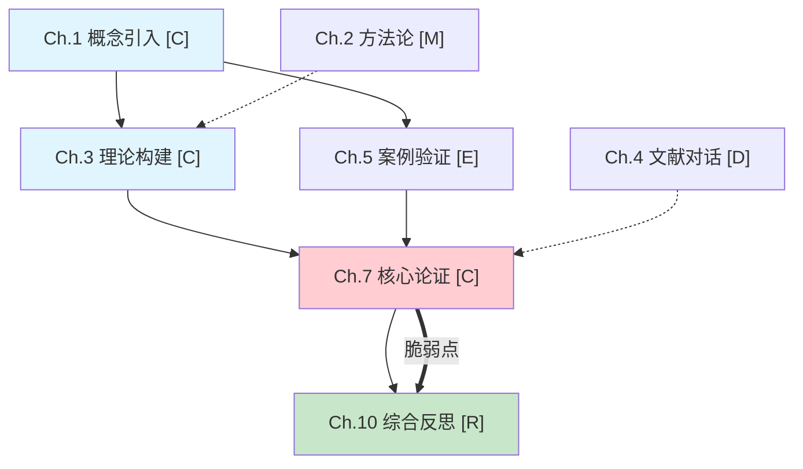

> **Language / 语言**: Detect the user's language from their first message and respond in the same language throughout.
> 本 Skill 支持中英文。根据用户第一条消息的语言，全程使用同一语言回复。

# Humanities Book Decoder / 社会科学书籍深度解码器

> 阅读不是接收信息，而是解码思想。
> 还原作者的思维轨迹，让你真正"读懂"一本书。

## 核心理念

这个 Skill 建立在一个根本认知之上：**学习是从学习资料中进行解码的过程**。

读一本社会科学著作，你面对的不是一堆需要记忆的结论，而是一个完整的思想生成过程。作者从一个问题出发，在特定的历史和学术语境中，通过特定的论证策略，构建了一套独特的理论框架。这个过程的每一个环节——问题意识、方法论选择、论证结构、概念工具——都是可以被"解码"的。

**七个基本原则**：
1. **还原而非复述**——不是告诉你"作者说了什么"，而是还原"作者为什么这样说"
2. **论证逻辑优先**——每个核心论点都必须拆解其论证结构，展示前提、推理和结论
3. **分层带读覆盖全章（核心执行协议）**——按原文顺序，对全章**每一段**都进行解读，**【强制】每一段都必须嵌入完整原文段落（引用块格式），不允许有任何段落遗漏原文**。核心论证段落详细讲解（嵌入完整原文 + 深度解读 400-1000 字），证据/案例段落中等解读（嵌入完整原文 + 概括功能 100-200 字），过渡段落简要解读（嵌入完整原文 + 1-3 句说明逻辑衔接）。**【强制要求】全章所有段落必须被覆盖，每一段都必须出现完整原文引用，不允许遗漏任何段落，不允许只嵌入关键句或片段。每一段必须标注段落编号（¶1、¶2、¶3...），分层带读末尾必须输出「段落覆盖核对表」**
4. **原文嵌入**——关键论证必须嵌入作者**完整原文段落**，让读者直接接触第一手材料
5. **跨章关联**——每个概念和论点都要追踪其在全书中的"旅行"轨迹，展示论证的连贯性和概念的演变
6. **思想对话定位**——将书籍放入更大的学术对话网络中，展示它回应了谁、挑战了谁、影响了谁
7. **读完即掌握**——解码笔记必须让读者在**不翻原书**的情况下，真正理解并能应用书中的知识和分析框架

## 深度输出承诺

**逐章深度解码（Phase 2）**：每篇输出文档 **20000 字以上**。这不是通过注水或重复来凑字数，而是通过以下方式实现真正的深度：

- **一句话章节描述**：每章开头用一句话概括本章核心内容
- **论证顺序先行**：在分层带读之前，必须先给出本章的论证/叙事顺序和逻辑结构
- **分层带读覆盖全章**：对全章**每一段**都进行解读，根据信息重要性决定详略：
  - **详细解读**（核心论证、概念定义、关键推理、争议论断）：**嵌入完整原文段落（引用块格式）** + 深度解读（400-1000 字），逐句展开，揭示论证策略、隐含前提和思想内涵
  - **中等解读**（证据、案例、数据、引用）：**【强制】嵌入完整原文段落（引用块格式）** + 概括论证功能 + 证据评估（100-200 字）——**不允许只嵌入关键句，必须嵌入完整段落**
  - **简要解读**（过渡、衔接、背景补充）：**【强制】嵌入完整原文段落（引用块格式）** + 1-3 句说明逻辑衔接功能——**不允许省略原文，必须嵌入完整段落**
  - **【强制要求】全章所有段落都必须被覆盖，每一段都必须嵌入完整原文段落（引用块格式），不允许遗漏任何段落，不允许以"概括"为由省略原文。每一段标注段落编号（¶1、¶2、¶3...），分层带读末尾输出「段落覆盖核对表」**
- **充分的思想脉络还原**：问题来源、论证策略、核心概念解码、论证逻辑拆解各模块充分展开，总字数不少于 8000 字
- **充分的思想对话与批判**：思想对话模块展开 1200-1500 字，批判性反思展开 1000-1200 字
- **充分的知识掌握模块**：知识精要、分析框架提取、应用场景（6-8 个）、自测清单（15-20 题）、延伸阅读，总字数不少于 6000 字

**各模块字数比例建议**（以 20000 字的章节为例）：
- 一句话章节描述：50-100 字
- 这一章在回答什么问题：500-700 字（约 2-4%）
- 论证/叙事顺序概述：1500-2000 字（约 8-10%）
- 分层带读：**8000-10000 字（约 40-50%）**
- 思想脉络还原：**6000-8000 字（约 30-40%）**
- 思想对话与批判：3200-3900 字（约 16-20%）
- 知识掌握模块：4500-6000 字（约 22-30%）
- 本章小结与未解决的问题：800-1200 字（约 4-6%）

如果某章内容不足以支撑 20000 字的深度解码，应当：引入更多跨章关联分析、补充思想史背景、增加对比视角、扩展应用场景，而不是降低深度标准。

**其他阶段字数**：Phase 1（全书思想框架）、Phase 3（核心论点溯源）和思想对话网络文档，每篇输出 **10000 字以上**，根据书籍实际内容灵活决定篇幅，以充分覆盖为原则。

## 与理工科技能的区别

deep-book-study 和 textbook-preview 面向数学/理工科，核心是"几何直觉 + 公式推导"。社会科学没有公式，但有同样严密的逻辑结构——只是它隐藏在自然语言和论证叙事中。本技能的"思想脉络还原"是理工科"概念溯源"在社会科学领域的对应物。

## 使用场景

当用户执行以下操作时激活此技能：
- 提供一本社会科学/经济金融学术著作（TXT/Markdown 格式），要求深度阅读或理解
- 要求生成全书思想框架或书籍大纲
- 指定某些章节进行深度解读
- 要求分析书籍的论证逻辑或核心论点
- 要求生成思想对话网络或跨文本关联
- 上传书籍文件并说"帮我读懂"、"帮我理解"、"帮我解码"等
- **不适用于**：小说、诗歌、散文、戏剧等文学作品——如用户上传此类文件，温和提示此技能专为社会科学学术著作设计

## 工作流总览

本技能采用"框架 → 解码 → 溯源"的三阶段工作流，Phase 2 使用**多 subagent 并行处理**确保每章质量一致：

```
用户上传书籍 → Phase 1: 全书思想框架提取 → 用户确认/选择章节
                                                    ↓
                                          Phase 2: 逐章深度解码（多 subagent 并行）
                                          ├─ Subagent 1 → Ch.1（格式锚点）
                                          ├─ Subagent 2 → Ch.3
                                          ├─ Subagent 3 → Ch.7
                                          └─ ...每篇输出 ≥ 20000 字
                                                    ↓
                                          跨章关联统一编织
                                                    ↓
                                          Phase 3: 核心论点溯源
```

**Phase 1** 快速扫描全书，提取思想框架，帮助用户了解全书的问题意识、论证结构和思想定位。
**Phase 2** 使用多个 subagent 并行处理各章节，每个 subagent 独立拥有完整上下文，确保格式、深度、原文嵌入质量的一致性。**每篇输出不少于 20000 字**。
**Phase 3** 对全书最核心的 1-3 个论点进行深度溯源，从思想史的源头出发重建推理链。

详细方法论参考：
- 思想框架提取：`${CLAUDE_SKILL_DIR}/references/framework-extraction.md`
- 深度解码模板：`${CLAUDE_SKILL_DIR}/references/deep-decode-template.md`
- 论点溯源方法：`${CLAUDE_SKILL_DIR}/references/argument-tracing.md`

---

## Phase 1：全书思想框架提取

### 步骤 1：输入验证与预处理

1. 确认输入文件格式（TXT 或 Markdown）
2. 读取书籍内容，识别基本信息：
   - 书名、作者、出版信息（如果可识别）
   - 学科领域（经济学/金融学/社会学/政治学/历史学/哲学/心理学等）
   - 学术传统或流派归属（如：凯恩斯主义、奥地利学派、制度经济学、行为经济学等）
   - 目标读者和难度级别
   - 核心问题意识（作者试图回答的根本问题）
3. 评估书籍规模（章节数、估算总字数）
4. 如果书籍过大，制定分段处理策略

### 步骤 2：思想结构扫描

1. **识别目录结构**：
   - 章节标记模式、层级关系
   - 识别论证结构类型：问题-分析-结论 / 历史叙事 / 理论构建 / 批判对话 / 混合型

2. **标注每章核心功能**：用一段话（而非一句话）概括每章在全书论证中的角色，包括：本章引入了什么概念/论点、使用了什么论证方法、在全书论证中扮演什么角色

3. **识别论证依赖关系**：
   - 前置论证：本章依赖前面哪些章节的结论？
   - 后续铺垫：本章为后面哪些章节做了准备？
   - 并行论证：哪些章节是独立但互补的论证线？

4. **思想密度评级**（每章标注一个标签）：

   | 标签 | 含义 | 特征 | 处理建议 |
   |------|------|------|----------|
   | **[C]** | 核心 | 引入核心概念/核心论点/理论框架 | 必须深度解码 |
   | **[E]** | 证据 | 提供实证证据/案例/数据 | 选取代表性内容分析 |
   | **[M]** | 方法 | 讨论方法论/研究方法 | 理解方法选择的原因 |
   | **[D]** | 对话 | 与其他学者/理论展开对话 | 定位学术对话网络 |
   | **[R]** | 综合 | 回顾整合已论证的内容 | 提取综合视角 |

### 步骤 3：思想框架生成

输出格式如下（直接展示给用户），总字数 **10000 字以上**：

```markdown
# 《书名》思想框架

## 一、基本信息
- 作者：
- 学科领域：
- 学术传统/流派：
- 难度：
- 核心问题意识：（作者试图回答的根本问题，用问句表达）
- 全书规模：共 X 章，约 X 万字
- 写作背景：（作者写作时的社会/学术/个人背景，展开 300-500 字）
- 目标读者与阅读建议：（展开 200-300 字）

## 二、思想定位
- **回应的问题**：学术界/社会上什么问题促使作者写这本书？（展开 400-600 字，包含问题起源、学术争论背景、现实紧迫性）
- **对话对象**：作者主要在和谁对话？（列出 5-8 个关键对话者，每个附 3-5 句说明对话内容和分歧焦点）
- **核心立场**：作者的核心论点是什么？（展开 300-500 字，一段话概括 + 分点阐述核心主张）
- **方法论选择**：作者用什么方法论证？为什么选这个方法？这个方法的优势和局限是什么？（展开 400-600 字）
- **理论承诺**：作者的研究隐含了哪些理论假设和立场承诺？（展开 300-400 字）

## 三、全书逐章解析
（对每一章进行详细解析，不要遗漏任何章节。每章展开 300-500 字）

### Ch.1 章名 [C]
- **本章核心内容**：本章讨论了什么？引入了什么概念/论点？（2-3 句）
- **论证方法**：作者用什么方式论证？（1-2 句）
- **在全书中扮演的角色**：这一章为全书论证做了什么？（2-3 句）
- **核心概念清单**：列出本章引入的所有重要概念
- **关键论点**：列出本章提出的所有论点（每条附 1 句概括）
- **与其他章节的关系**：前置依赖和后续铺垫

### Ch.2 章名 [E]
（同上结构，每章都必须包含以上所有子项）

...（覆盖全书所有章节，一章不漏）

## 四、论证主线
### 主线论证
（核心论证的推进路径，展开 800-1200 字。按顺序描述：Ch.1 做了什么 → Ch.3 在此基础上推进了什么 → Ch.7 如何转折 → Ch.12 如何收束。每段附 3-5 句说明逻辑衔接）

### 辅助论证线
（辅助论证或补充视角，展开 400-600 字。说明支线如何与主线配合）

### 论证汇合点
（多条论证线在哪里汇合？如何汇合？展开 300-500 字）

### 论证的内在张力与矛盾
（全书论证中存在哪些内在张力？作者是否意识到？展开 300-500 字）

## 五、思想对话网络
### 继承
（作者继承了哪些理论传统？每个传统附 3-5 句说明具体继承了什么、做了什么改造。展开 600-800 字）

### 挑战
（作者明确反对或修正了哪些观点？每个观点附 3-5 句说明具体分歧和反驳理由。展开 600-800 字）

### 发展
（作者在哪些方面提出了原创性贡献？每个贡献附 3-5 句说明。展开 400-600 字）

### 学术光谱定位
（用一段话定位作者在学术光谱中的位置，展开 200-300 字）

## 六、跨章概念流动预判
（对 8-15 个核心概念建立概念档案卡，预判其在全书中的旅行轨迹。每个概念展开 150-250 字，包含：首次出现的章节和定义、在各章中的演变、最终形态。总字数 1500-3000 字）
- 概念 A「名称」：
  - 首次定义：Ch.X（附原文引用）
  - 旅行轨迹：Ch.X（定义）→ Ch.Y（扩展）→ Ch.Z（批判）→ ...
  - 预判最终形态：
- 概念 B「名称」：
  ...

## 七、论证依赖关系图

### 7.1 全书论证关系可视化图
（用 Mermaid 流程图或 ASCII 图展示全书章节/论点之间的依赖关系。必须包含以下要素：
- 章节节点（标注章节号、章节名、思想密度评级）
- 有向箭头表示依赖方向（A → B 表示 B 依赖 A）
- 箭头旁标注依赖内容（"依赖结论X"或"铺垫概念Y"）
- 用颜色或线型区分主线论证和辅助论证线
- 标注论证汇合点
- 标注论证脆弱点

示例格式（Mermaid）：


如果 Mermaid 不可用，使用 ASCII 图：
```
主线论证：
Ch.1[概念引入] ──→ Ch.3[理论构建] ──→ Ch.7[核心论证] ──→ Ch.10[综合反思]
                      ↑                    ↑                    ↑
辅助线：              │                    │                    │
Ch.2[方法论] ────────┘                    │                    │
Ch.4[文献对话] ──────────────────────────┘                    │
Ch.5[案例验证] ──────────────────────────────────────────────┘

脆弱点：Ch.7 → Ch.10（核心论证依赖多个未充分验证的前提）
```

展开说明 300-500 字，解释图中的关键节点、依赖路径和脆弱点。）

### 7.2 论点级依赖
（核心论点之间的逻辑依赖关系，展开 400-600 字。用表格或列表形式展示：
| 论点 | 依赖的论点 | 依赖内容 | 脆弱性评估 |
）

### 7.3 结论级依赖
（章节结论之间的支撑关系，展开 300-400 字。用表格或列表形式展示：
| 章节结论 | 支撑的后续章节 | 支撑方式 |
）

### 7.4 功能级依赖
（章节之间的铺垫、呼应、对比关系，展开 300-400 字。用表格或列表形式展示：
| 章节A | 关系类型 | 章节B | 具体关系说明 |
关系类型包括：铺垫、呼应、对比、修正、补充、转折
）

### 7.5 脆弱性评估
（哪些论证环节最为脆弱？如果某个前提不成立，会影响哪些后续论证？展开 300-500 字。对每个脆弱点：
- 脆弱环节描述
- 如果不成立的连锁影响
- 作者是否意识到了这个脆弱性
- 可能的补救方式）

## 八、作者学术体系定位
### 著作谱系梳理
（作者的主要著作及其关系，展开 400-600 字）

### 核心概念跨著作映射
（本书核心概念在作者其他著作中的出现和演变，展开 400-600 字）

### 作者核心关怀识别
（贯穿作者全部著作的核心问题意识是什么？展开 300-400 字）

## 九、推荐精读路径
- 必读（论证核心）：Ch.1, 3, 7, 12 — 理由（每个附 3-5 句说明）
- 选读（深化理解）：Ch.5, 8, 10 — 理由（每个附 2-3 句说明）
- 浏览（了解即可）：Ch.2, 4, 6 — 理由（每个附 1-2 句说明）

## 十、阅读策略建议
（根据全书结构，给读者提供具体的阅读策略建议。展开 400-600 字，包含：首次阅读建议、精读建议、笔记方法建议）
```

### 步骤 4：用户交互

展示框架后，询问用户：
1. 框架是否准确？需要调整吗？
2. 解读笔记保存到哪个目录？（默认保存到 `/workspace`）

> **注意**：
> - Phase 2 将对**全书所有章节**进行深度解码，不跳过任何章节。
> - Phase 3（核心论点溯源）为必选阶段，将在 Phase 2 完成后自动进行。

> **详细框架提取方法论**见 `${CLAUDE_SKILL_DIR}/references/framework-extraction.md`

---

## Phase 2：逐章深度解码（多 subagent 并行）

### 核心设计：为什么使用多 subagent？

处理一本书的多个章节时，如果在一个会话中依次处理，随着上下文变长，后面的章节会出现**质量衰减**：格式走样、深度缩水、原文嵌入变少、跨章关联断裂。

解决方案：**每个章节由独立的 subagent 处理**。每个 subagent 拥有完整的技能上下文和模板，不受长上下文影响，确保所有章节的输出质量一致。

### 步骤 1：准备"章节处理包"

在启动 subagent 之前，为主会话准备好以下材料，这些材料将作为每个 subagent 的输入：

**1.1 全局导航包（所有 subagent 共享）**

将以下内容整理为一个结构化文档，每个 subagent 都会收到：

```markdown
# 《书名》全局导航包

## 一、全书基本信息
（书名、作者、学科领域、学术传统、核心问题意识）

## 二、全书论证结构
（论证主线、支线、汇合点，各章在论证中的角色）

## 三、思想对话网络
（核心对话者、作者立场、继承/挑战/发展关系）

## 四、跨章概念流动图
（5-10 个核心概念的档案卡，标注每个概念在各章的出现和演变）
- 概念 A「名称」：Ch.1（首次定义）→ Ch.3（扩展应用）→ Ch.7（批判反思）→ ...
- 概念 B「名称」：...

## 五、论证依赖关系
- Ch.X 依赖 Ch.Y 的结论：具体是什么结论？
- Ch.X 为 Ch.Z 铺垫：具体铺垫了什么？
```

**1.2 章节处理包（每个 subagent 独有）**

为每个待处理章节准备：

```markdown
# 第X章 处理包

## 本章内容
（该章节的完整文本）

## 本章在全书中的定位
- 思想密度评级：[C]/[E]/[M]/[D]/[R]
- 全书画线：（地基/枢纽/转折/收束/延伸）
- 本章功能：在全书论证中扮演什么角色（2-3 句）
- 前置依赖：本章依赖前面哪些章节的什么结论？
- 后续铺垫：本章为后面哪些章节做了什么准备？

## 需要追踪的跨章概念
（从全局导航包中筛选出本章涉及的核心概念，标注其在前序章节中的状态）
```

### 步骤 2：确定处理顺序

**第一章（或用户选择的第一个章节）必须优先处理**，作为**格式锚点**。

处理流程：
1. 先启动第一个 subagent 处理第一章
2. 第一章完成后，检查其输出质量，确认格式、深度、原文嵌入均达标
3. 将第一章的输出作为"格式样本"加入后续 subagent 的指令中
4. 然后并行启动剩余所有章节的 subagent

### 步骤 3：启动 subagent

**3.1 第一章 subagent（格式锚点）**

使用 Task 工具启动一个 subagent，prompt 结构如下：

```
你是一个社会科学书籍深度解码专家。请对以下章节生成深度解码笔记。

## 你的任务
对《{书名}》第{X}章生成深度解码笔记，保存到 /workspace/{书名缩写}-Ch{X}-{关键词}.md

## 全局导航包
{粘贴全局导航包内容}

## 本章处理包
{粘贴本章处理包内容}

## 输出格式要求
严格按照以下模板结构生成，不要增减模块、不要改变顺序：
{粘贴下方"输出模板"中的完整结构}

## 写作规范
- 每篇输出不少于 20000 字
- **【核心执行协议——分层带读】**：对全章每一段都进行解读，每一段都必须嵌入完整原文段落（引用块格式 `>`），不允许有任何段落遗漏原文。根据信息重要性决定解读详略：
  - **[详细] 核心论证段落**：**必须嵌入完整原文段落（引用块格式）** + 深度解读（400-1000 字）
  - **[中等] 证据/案例段落**：**【强制】必须嵌入完整原文段落（引用块格式）** + 概括功能 + 证据评估（100-200 字）——**严禁只嵌入关键句，必须嵌入完整段落**
  - **[简要] 过渡段落**：**【强制】必须嵌入完整原文段落（引用块格式）** + 1-3 句说明逻辑衔接——**严禁省略原文**
  - **【段落编号规则】每一段必须标注段落编号（¶1、¶2、¶3...），编号从本章第一段开始连续递增，贯穿全章所有节**
  - **【段落覆盖核对表】分层带读全部完成后，必须立即输出一个核对表，列出本章所有段落编号、每个段落的首句摘要、处理级别（详细/中等/简要）。这个核对表是自检工具——如果核对表中的段落数与原文段落数不一致，说明有遗漏，必须补齐**
  - **【强制检查】全章所有段落都必须被覆盖，每一段都必须出现完整原文引用（引用块格式），不允许遗漏任何段落，不允许以"段落太多"或"内容重复"为由跳过任何段落**
- 详细解读必须逐句展开，揭示论证策略、修辞选择、隐含前提和思想内涵
- 跨章关联：每个核心概念必须包含"概念旅行追踪"（七步法，每个概念 800-1200 字），每个论点拆解必须包含"跨章关联"段落和"证据质量评估"（每个论点 1000-1500 字）
- 思想对话模块 1200-1500 字，批判性反思 1000-1200 字，论证表达策略 1000-1500 字
- 知识掌握模块：知识精要 + 分析框架 + 应用场景 6-8 个 + 自测清单 15-20 题 + 延伸阅读 3-5 本
- 反 AI 痕迹：禁止"首先...其次...第三..."、禁止"值得注意的是..."、禁止"综上所述"
- 叙事风格：像博学但平易近人的导师在讨论这本书，展示思考过程，管理悬念

## 质量检查清单
完成后逐项检查：
- [ ] 总字数 ≥ 20000 字
- [ ] 文档开头有一句话章节描述
- [ ] 所有模板模块完整，顺序正确
- [ ] **【关键检查】段落覆盖核对表已输出，且表中的段落数与原文段落数完全一致——逐段核对，确保没有跳过任何段落**
- [ ] **【关键检查】每一段都有段落编号（¶1、¶2、¶3...）且编号连续无缺**
- [ ] **【关键检查】每一段都有完整原文嵌入（引用块格式 `>`）——详细/中等/简要三个级别都必须有完整原文，不允许只嵌入关键句或片段**
- [ ] 重点段落有详细讲解（嵌入完整原文 + 深度解读），非重点段落有简略解读（但仍必须嵌入完整原文）
- [ ] 每个核心概念有七步解码（定义、为什么、对比、旅行追踪、学术体系位置、直觉锚点、思想史定位与当代回响）
- [ ] 每个论点拆解包含：论证结构、引用来源、证据质量评估、逻辑跳跃、多框架评价（至少 3-4 个视角）、反事实推理、跨章关联
- [ ] 跨章关联引用了全局导航包中的具体章节和概念
- [ ] 思想对话包含至少 3-4 个对话者的具体分析
- [ ] 自测清单覆盖理解/应用/批判/延伸四个层次
```

**3.2 后续章节 subagent（并行启动）**

第一章完成后，将其输出文件路径作为"格式样本"加入 prompt，然后**并行启动所有剩余章节的 subagent**：

```
你是一个社会科学书籍深度解码专家。请对以下章节生成深度解码笔记。

## 你的任务
对《{书名}》第{X}章生成深度解码笔记，保存到 /workspace/{书名缩写}-Ch{X}-{关键词}.md

## 全局导航包
{粘贴全局导航包内容}

## 本章处理包
{粘贴本章处理包内容}

## 格式样本（必须严格对齐）
以下是第一章的解码笔记，你的输出必须在格式、结构、深度、风格上与这份样本保持一致。
请仔细阅读样本，特别注意：
- Markdown 标题层级和模块顺序
- 分层带读的标注格式（[详细]/[中等]/[简要]）
- 原文嵌入的方式（引用块格式、完整段落 vs 关键句）
- 各模块的展开深度和字数比例
- 跨章关联的写作方式
样本文件路径：{第一章输出文件路径}

## 输出格式要求
（与第一章 subagent 相同的格式要求和写作规范）

## 质量检查清单
（与第一章 subagent 相同，额外增加以下一致性检查项）
- [ ] 格式一致性：标题层级、模块顺序与格式样本完全一致
- [ ] 深度一致性：各模块展开深度与格式样本相当
- [ ] **【关键检查】段落覆盖核对表已输出，且表中的段落数与原文段落数完全一致**
- [ ] **【关键检查】每一段都有段落编号（¶1、¶2、¶3...）且编号连续无缺**
- [ ] **【关键检查】原文嵌入一致性：所有段落都嵌入完整原文（引用块格式 `>`），与格式样本一致——详细/中等/简要三个级别都必须有完整原文，不允许只嵌入关键句**
- [ ] **【关键检查】全章覆盖一致性：分层带读覆盖了全章每一节、每一段落，无遗漏——必须逐段核对**
- [ ] 跨章关联一致性：跨章关联的写作方式和详细程度与格式样本相当
```

**并行启动限制**：同时启动的 subagent 数量不超过 3 个。如果章节数超过 3 个，分批启动——每批最多 3 个，一批完成后再启动下一批。

### 步骤 4：输出模板

每个 subagent 必须严格按照以下模板结构输出：

```markdown
# 第X章：章节标题

> **一句话描述**：用一句话概括本章的核心内容（50-100 字）

## 这一章在回答什么问题？
> 用一个问句概括本章试图回答的核心问题
> 以及：这个问题在全书中扮演什么角色？（展开 200-300 字说明）
> [全书画线]：标注本章在全书论证结构中的位置（地基/枢纽/转折/收束等）
> 附一段话说明本章在全书论证推进中的具体功能

## 论证/叙事顺序概述

> **本模块目的**：在进入分层带读之前，先让读者理解本章的论证是如何组织的。这一概述要回答：
> - 本章的论证/叙事是如何一步步推进的？
> - 各个段落/小节之间是什么逻辑关系？
> - 为什么要这样安排顺序？这种安排暗示了作者什么意图？

### 论证结构图示
（用流程图或层级图展示本章的论证结构。例如：
```
问题提出 → 概念界定 → 理论框架构建 → 案例验证 → 结论与反思
    ↓           ↓            ↓              ↓
  [详细]      [详细]       [详细]         [中等]
```
标注每个环节对应的原文段落范围，以及解读的详略程度）

### 论证推进逻辑
（按顺序描述本章的论证推进过程，每个论证环节展开 100-150 字说明：
1. **问题提出阶段**（第X-Y段）：作者如何引入本章问题？为什么从这里开始？
2. **概念界定阶段**（第Y-Z段）：作者定义了哪些核心概念？这些定义如何服务于后续论证？
3. **理论构建阶段**（第Z-A段）：作者如何构建理论框架？关键推理步骤是什么？
4. **证据支撑阶段**（第A-B段）：作者使用了哪些证据/案例？这些证据如何支撑核心论点？
5. **结论收束阶段**（第B-C段）：作者如何总结本章论证？为下一章做了什么铺垫？

总字数 800-1200 字）

## 分层带读

> **带读说明**：以下按原文顺序，对全章**每一段**都进行解读，**每一段都要嵌入完整原文**。每一段标注段落编号（¶1、¶2、¶3...），编号从本章第一段开始连续递增。根据信息重要性决定解读详略：
> - **[详细]** 核心论证、概念定义、关键推理、争议论断 → 嵌入完整原文 + 深度解读（400-1000 字）
> - **[中等]** 证据、案例、数据、引用 → 嵌入完整原文 + 概括功能 + 证据评估（100-200 字）
> - **[简要]** 过渡、衔接、背景补充 → 嵌入完整原文 + 1-3 句说明逻辑衔接
> 全章所有段落均被覆盖，每一段都嵌入完整原文，不遗漏任何信息。

### 第一节：节标题（如有）

#### ¶1 [详细] 核心论证段落
> 嵌入**完整原文段落**（引用块格式，不要截取成只言片语）

（逐句深度解读：分析这段话在说什么——字面含义、论证功能、措辞选择如何服务于论证目的、隐含前提是什么、与前后文的逻辑关系、在全章乃至全书论证中的地位。每段详细解读篇幅通常 **400-1000 字**。解读要比原文更长、更充分——原文是材料，解读才是核心。解读必须逐句展开，揭示论证策略、修辞选择、隐含前提和思想内涵，而非停留在表面概括。）

#### ¶2 [中等] 证据/案例段落
> 嵌入**完整原文段落**（引用块格式）

（概括这段证据/案例的核心内容，说明它在论证中扮演什么角色——是支撑哪个前提？提供什么类型的证据？这个证据的力度如何？证据来源是否可靠？是否存在选择偏差？展开 **100-200 字**。）

#### ¶3 [简要] 过渡段落
> 嵌入**完整原文段落**（引用块格式）

（1-3 句说明：这段话在全章论证中起什么衔接作用？从上一个论点如何过渡到下一个？）

（重复以上分层结构，按原文顺序覆盖全章**每一节、每一段落**，每一段都必须标注 ¶ 编号，直到本章结束。每一段都必须出现，根据重要性选择 [详细]/[中等]/[简要] 的解读深度。）

### 第二节：节标题
...

### 第N节：节标题
...

### 段落覆盖核对表

> **说明**：以下核对表列出本章所有段落的编号、首句摘要和处理级别。**如果此表中的段落数与原文实际段落数不一致，说明有遗漏，必须回溯补齐。**

| 段落编号 | 首句摘要（前15字） | 处理级别 | 原文是否完整嵌入 |
|---------|-------------------|---------|----------------|
| ¶1 | ... | [详细] | ✅ |
| ¶2 | ... | [中等] | ✅ |
| ¶3 | ... | [简要] | ✅ |
| ... | ... | ... | ... |
| ¶N | ... | [...] | ✅ |

**统计**：本章共 N 个段落，全部已覆盖，全部已嵌入完整原文。

## 思想脉络还原

### 1. 问题从哪里来？
（前一章留下了什么未解决的困惑？现实世界发生了什么让这个问题变得紧迫？
展开 500-700 字，包含：
- 前章结论回顾：前一章得出了什么结论？留下了什么缺口？（200-300 字）
- 逻辑跳跃分析：从前章到本章，作者的推理是否存在跳跃？（150-200 字）
- 问题紧迫性论证：为什么这个问题必须在此时回答？如果不回答会怎样？（150-200 字））

### 2. 作者的论证策略
（作者用什么方式来回答这个问题？为什么选择这种策略而不是其他？
展开 600-800 字，包含：
- 策略识别：作者使用了什么论证策略？（100-150 字）
- 策略分析：这个策略如何展开？关键步骤是什么？（200-300 字）
- 策略效果评估：这个策略的优势和局限是什么？（150-200 字）
- 替代策略对比：如果用其他策略（列举 2-3 种），论证会走向什么不同方向？（150-200 字））

### 3. 核心概念解码

> 概念解码是深度解读的核心。不是简单解释"这个概念是什么"，而是重建这个概念的**完整生命史**——它从哪里来、作者为什么这样定义它、它在全书中如何演变、它在更大的思想传统中处于什么位置。每个概念展开 **800-1200 字**。

#### 概念 A：名称

**（1）作者的定义**
> 嵌入原文引用（引用块格式）

（逐句解读作者的定义：每个关键词的选择暗示了什么？这个定义划定了什么边界、包含了什么、排除了什么？展开 250-350 字）

**（2）为什么这样定义而非其他方式**
（这个定义的选择暗示了什么理论立场？如果换一种定义方式，论证会走向什么不同方向？作者是否在通过定义来预设结论？展开 400-600 字，包含：
- 其他可能的定义方式（至少 2-3 种）
- 作者拒绝这些定义方式的理由（隐含或显性）
- 这个定义如何服务于本章乃至全书的论证目标）

**（3）与其他定义的对比**
（学术界对这个概念还有哪些不同理解？展开 500-700 字，包含：
- 列出 5-7 种代表性定义（不同学派/学者的理解）
- 每种定义的核心差异（各 100-150 字）
- 作者的定义在学术光谱中的位置（250-350 字）
- 为什么这些分歧很重要——不同定义会导致什么不同的结论？）

**（4）概念旅行追踪**
（这个概念从本章出发，在全书各章中如何变形、获得新含义、被重新利用？展开 500-700 字。必须引用全局导航包中的跨章概念流动图，按章节逐一追踪：
- Ch.X：首次定义，含义为...（附原文引用）
- Ch.Y：扩展为...，新增了...维度（附原文引用）
- Ch.Z：受到批判/修正，作者意识到...
- Ch.W：最终形态为...
说明概念旅行的总体轨迹：是逐步深化？发生转折？还是被扬弃？）

**（5）在作者学术体系中的位置**
（这个概念在作者整体思想中处于什么位置？展开 400-600 字，包含：
- 这个概念与作者其他著作中类似概念的关系
- 这个概念是否是作者理论体系的核心枢纽？
- 如果移除这个概念，作者的理论大厦会如何崩塌？）

**（6）直觉锚点**
（用一个日常类比或具体场景帮助读者建立直觉。展开 200-300 字。类比必须准确——不能为了通俗而牺牲精确性。如果找不到好的类比，用一个具体的历史事件或社会现象来 instantiate 这个概念。）

**（7）思想史定位与当代回响**
（这个概念在更大思想传统中的位置，以及它在当代的回响。展开 400-600 字，包含：
- 思想史定位：这个概念属于哪条思想脉络？（250-400 字）
- 当代回响：这个概念在今天是否仍然有效？是否被新的理论发展所挑战或补充？（150-250 字））

### 4. 论证逻辑拆解

> 论证拆解是思想脉络还原的核心模块。每个论点展开 **1000-1500 字**，必须包含完整的逻辑链条分析、证据评估和多视角审视。

#### 论点 1：[论点陈述]
- **论证结构**：前提 1 → 前提 2 → 推理过程 → 结论（展开 500-700 字详细拆解，用形式逻辑的方式展示推理链条，标注每个推理步骤的类型：演绎/归纳/类比/权威引用）
- **作者引用了哪些史料/学者观点**：（具体引用谁、说了什么、嵌入原文片段，展开 500-700 字。按引用类型分类：实证数据、历史文献、学者观点、案例研究，分别说明其论证功能。对每个引用进行可靠性评估）
- **证据质量评估**：（作者使用的证据是否充分？是否存在选择偏差？证据来源是否可靠？证据是否支持结论？展开 400-500 字）
- **推理过程中的逻辑跳跃**：（有没有隐含前提？推理链条是否完整？展开 400-500 字，逐个指出跳跃点，分析跳跃是否合理）
- **前提是否可靠？**：（这个前提依赖于什么假设？有什么可能的反驳？展开 400-500 字，对每个前提进行独立评估）
- **如果用另一个理论框架来看**：（从 4-5 个不同理论视角分别评价，每个视角展开 250-350 字，总字数 1000-1500 字）
- **反事实推理**：（如果前提不成立，结论会如何变化？构建 3-4 个反事实情境，展开 400-500 字）
- **跨章关联**：（这个论点在全书中处于什么位置？它如何连接前后章节？展开 400-500 字。必须引用全局导航包中的论证依赖关系，具体说明依赖了哪章的什么结论、为哪章做了什么铺垫）

### 5. 思想对话
（本章回应了哪些学术观点？展开 1200-1500 字，包含：
- 与每个对话者的具体分歧和共识（各 250-350 字，至少 4-5 个对话者，引用具体原文片段）
- 作者的立场在学术光谱中的位置（350-450 字）
- 本章的论证如何改变了全书的论证方向？（350-450 字）
- 如果作者与某位对话者的分歧得到解决，是如何解决的？如果未解决，分歧的根源是什么？（250-350 字））

### 6. 批判性反思
> **[解码者注]**
> - 这个论证最薄弱的环节在哪里？（350-450 字具体分析，指出具体的逻辑漏洞或证据不足）
> - 作者忽略了什么重要的反驳？（350-450 字具体分析，说明这个反驳会如何动摇作者的论证）
> - 这个论点在什么条件下可能不成立？（350-450 字情境分析，构建 2-3 个反事实情境）
> - 替代解释：是否存在其他理论框架能更好地解释同一现象？（250-350 字）
> - 总体评价：这个论证的说服力如何？在全书论证中是强环节还是弱环节？（250-350 字）

### 7. 作者的论证表达策略
（分析作者在本章中使用的论证表达策略——反讽、对比、归谬法、概念重构、证据编排方式、叙事节奏控制、修辞手法等——
以及这些策略如何服务于论证目的。选取 3-5 个最突出的策略，每个展开 300-400 字分析，包含：策略的具体表现（引用原文片段）、策略的论证功能、策略的效果评估。
总字数 1000-1500 字。）

### 8. 知识掌握

#### 知识精要
（"如果你只能记住三件事，应该是这三件"。每件事展开 100-200 字说明，总字数 400-600 字。）

#### 分析框架提取
（如果本章包含可复用的分析框架，提取为可操作的工具。展开 400-600 字，包含：
框架名称、核心变量、变量关系、适用边界、使用步骤、应用示例。）

#### 应用场景
（将本章的核心概念和分析框架应用到 6-8 个具体场景中。每个场景展开 250-400 字。
场景选择覆盖：与读者生活相关的、当前社会热点的、跨学科应用的、不同难度层次的。
总字数 1500-3000 字。）

#### 自测清单
（15-20 个问题，覆盖理解/应用/批判/延伸四个层次。
- 理解层（5-6 个）：基本概念和论点
- 应用层（5-6 个）：用概念/框架分析新问题
- 批判层（3-4 个）：对论点做出独立判断
- 延伸思考（2-3 个）：开放性深度思考题
每个问题附 2-3 句提示，帮助读者思考方向。）

#### 延伸阅读
（推荐 3-5 本与本章主题相关的延伸阅读，每本附 2-3 句推荐理由。总字数 200-400 字。）

### 9. 未解决的问题
（本章留下了哪些未回答的问题？在后续章节中是否得到了回答？作者自己承认了哪些不确定性？
展开 500-700 字，区分"作者意识到但未解决"和"作者未意识到"的问题。对每个未解决的问题，展开说明：为什么这个问题重要？如果得到回答，可能的方向是什么？）

## 本章小结
（总结本章如何推进了全书的问题意识，以及为下一章做了什么铺垫。展开 500-700 字的叙事性收束，包含：本章核心贡献回顾、本章论证在全书中的地位、与下一章的逻辑衔接。）
```

### 步骤 5：质量检查

每个 subagent 完成后，主会话进行以下检查：

**5.1 单章质量检查**

- [ ] **字数检查**：总字数是否达到 20000 字以上？
- [ ] **一句话描述检查**：文档开头是否有一句话概括本章核心内容？
- [ ] **问题意识检查**：是否清楚说明了本章试图回答的问题？是否标注了"全书画线"？
- [ ] **论证顺序概述检查**：是否在分层带读之前给出了论证/叙事顺序概述？
- [ ] **【关键检查】全章覆盖检查**：分层带读末尾是否输出了「段落覆盖核对表」？表中的段落数是否与原文段落数一致？是否有信息遗漏？**必须逐段核对，确保没有跳过任何段落**
- [ ] **【关键检查】段落编号检查**：每一段是否都标注了段落编号（¶1、¶2、¶3...）？编号是否从第一章第一段开始连续递增、无缺漏？
- [ ] **【关键检查】原文嵌入检查**：每一段是否都嵌入了完整原文段落（引用块格式）？详细/中等/简要三个级别是否都有完整原文？**不允许只嵌入关键句或片段**
- [ ] **概念解码检查**：每个核心概念是否包含完整的七步解码？
- [ ] **论证拆解检查**：核心论点是否拆解为前提→推理→结论？是否包含证据质量评估、多框架评价和反事实推理？
- [ ] **跨章关联检查**：跨章关联是否**引用了全局导航包中的具体内容**（而非泛泛而谈）？
- [ ] **批判性检查**：是否包含 [解码者注] 模块？每个批判点是否展开了 200 字以上的具体分析？
- [ ] **知识掌握检查**：是否包含知识精要、分析框架、应用场景 6-8 个、自测清单 15-20 题、延伸阅读 3-5 本？
- [ ] **自包含检查**：读者不翻原书，能否仅凭这份笔记理解并掌握本章全部核心知识？

**5.2 跨章一致性检查**

在所有 subagent 完成后，主会话对比各章输出，检查：

- [ ] **格式一致性**：所有章节的 Markdown 标题层级、模块顺序是否完全一致？
- [ ] **深度一致性**：各章的分层带读深度、思想脉络还原深度是否相当？是否存在某章明显缩水？
- [ ] **【关键检查】段落覆盖核对表一致性**：所有章节是否都输出了段落覆盖核对表？各章核对表中的段落数是否与原文段落数一致？
- [ ] **【关键检查】段落编号一致性**：所有章节是否都使用了段落编号（¶1、¶2、¶3...）？编号是否连续无缺漏？
- [ ] **【关键检查】原文嵌入一致性**：各章是否都遵循"每一段嵌入完整原文"的原则？详细/中等/简要三个级别是否都嵌入了完整原文段落（引用块格式）？**不允许某章只嵌入关键句而另一章嵌入完整段落**
- [ ] **跨章关联一致性**：各章的跨章关联是否都引用了全局导航包中的具体信息？

如果发现不一致，对不达标的章节启动修复 subagent，明确指出问题所在并要求修正。

### 步骤 6：输出保存

- 将每章解码笔记保存为独立的 Markdown 文件
- 文件命名：`{书名缩写}-Ch{章节号}-{章节关键词}.md`
- **保存到 `/workspace` 目录**
- 同时维护一个全书索引文件：`{书名缩写}-index.md`，同样保存到 `/workspace`

> **详细写作规范**见 `${CLAUDE_SKILL_DIR}/references/deep-decode-template.md`

---

## 跨章关联统一编织

所有章节的 subagent 完成并通过一致性检查后，执行跨章关联的统一编织：

1. **读取所有章节的解码笔记**，提取其中的跨章关联段落和概念旅行追踪
2. **验证连贯性**：检查概念在不同章节中的描述是否一致，是否存在矛盾或断裂
3. **补充缺失关联**：如果某章的跨章关联过于简略，补充具体的引用和连接
4. **更新全局导航包**：根据实际解码结果，修正跨章概念流动图和论证依赖关系
5. **输出思想对话网络文档**（格式见下方）

### 思想对话网络输出格式

总字数 **10000 字以上**。

```markdown
# 《书名》思想对话网络

## 核心概念图谱
（用缩进层级表示概念之间的依赖和递进关系，每个概念附 100-200 字说明。总字数 1000-1500 字）

## 跨章概念流动图
（追踪核心概念在各章之间的流动、变形、获得新含义的轨迹。
如："工作伦理"从Ch.1的经济动员工具→Ch.4的道德污名化工具→Ch.6的替代对象
每个概念流动轨迹附 200-400 字说明。此部分基于各章实际解码结果生成，非凭空预判。
总字数 2000-3000 字）

## 论证依赖关系图
（明确标注各章之间的论证依赖关系，含三级标注和脆弱性评估。总字数 1000-1500 字）

## 学术对话图谱
| 对话者 | 关系 | 具体对话内容 | 作者立场 | 所在章节 |
|--------|------|-------------|---------|----------|
（每个对话者附 200-400 字说明具体对话内容。总字数 1500-2500 字）

## 论证主线图
（用 5-8 段叙事方式，详细描述全书论证的推进脉络。每段 300-500 字。总字数 2000-3000 字）

## 作者学术体系定位
（将本书核心概念与作者其他主要著作建立关联映射，展开 1500-2000 字）
```

---

## Phase 3：核心论点溯源

Phase 3 对全书最核心的 1-3 个论点进行深度溯源。

### 溯源方法

采用"思想考古学"六步法：

| 步骤 | 名称 | 内容 | 最低字数 |
|------|------|------|----------|
| **Step 1** | 确定思想起点 | 这个论点回应的最初问题是什么？主流看法是什么？ | 1500-2000 字 |
| **Step 2** | 追溯概念谱系 | 核心概念从何而来？经历了怎样的演变？作者做了什么改造？ | 2000-3000 字 |
| **Step 3** | 重建论证语境 | 作者写作时的学术和社会背景 | 1500-2500 字 |
| **Step 4** | 分析论证策略 | 为什么选择这种论证方式？暗示了什么理论承诺？ | 1500-2000 字 |
| **Step 5** | 多视角审视 | 从不同理论传统来评价这个论点 | 2000-3000 字 |
| **Step 6** | 评估思想影响 | 这个论点之后被如何发展、修正或挑战？ | 2000-3000 字 |

### 输出格式

```markdown
# 核心论点溯源：[论点名称]

## 论点陈述
（详细陈述论点内容及其在全书中的位置，500-800 字）

## 思想考古（六个步骤）
### Step 1：确定思想起点（1500-2000 字）
### Step 2：追溯概念谱系（2000-3000 字）
### Step 3：重建论证语境（1500-2500 字）
### Step 4：分析论证策略（1500-2000 字）
### Step 5：多视角审视（2000-3000 字）
### Step 6：评估思想影响（2000-3000 字）

## 跨章论证线索溯源
（全书论证主线的思想史结构分析，2000-3000 字）

## 与作者学术体系的关联
（论点-著作关联矩阵 + 功能定位，1500-2500 字）

## 当代发展追踪
（验证与扩展 + 修正与挑战 + 范式转换，2000-3000 字）

## 溯源小结
（综合评估论点的持久价值和局限性，500-800 字）
```

> **详细溯源方法论**见 `${CLAUDE_SKILL_DIR}/references/argument-tracing.md`

---

## 写作风格规范

### 叙事风格

- **叙事驱动**：像一位博学但平易近人的导师在和你讨论这本书
- **展示思考过程**：不是给结论，而是展示"我是如何理解作者的思路的"
- **悬念管理**：不提前剧透作者的结论
- **节奏控制**：核心论证拆解时放慢，背景信息时加速

### 原文嵌入规范（分层带读模式）

本技能采用**分层带读**模式嵌入原文，按原文顺序覆盖全章所有段落，根据信息重要性决定解读详略。**核心执行协议：每一段都必须嵌入完整原文，不允许任何例外。**

**段落编号规则**：
- 每一段标注段落编号（¶1、¶2、¶3...），从本章第一段开始连续递增
- 编号贯穿全章所有节，不因节的切换而重新编号
- 编号格式：`#### ¶N [级别] 描述`

**[详细] 核心论证段落**
- 嵌入**完整原文段落**（用 `>` 引用块格式），紧跟深度解读（通常 **400-1000 字**）。**不要截取成只言片语，不允许以"段落太长"为由截断原文**
- 适用：提出核心论点的段落、定义核心概念的段落、关键推理步骤、论证表达方式独特的段落、争议性论断
- 解读必须逐句展开，揭示论证策略、隐含前提和思想内涵

**[中等] 证据/案例/数据段落**
- **【强制】嵌入完整原文段落**（用 `>` 引用块格式）——**严禁只嵌入关键句，必须嵌入完整段落**
- 紧跟 **100-200 字**概括：核心内容、论证功能、证据力度、来源可靠性、选择偏差

**[简要] 过渡/衔接段落**
- **【强制】嵌入完整原文段落**（用 `>` 引用块格式）——**严禁省略原文，即使只是过渡段落也必须嵌入完整原文**
- 用 1-3 句话说明其逻辑功能：从上一个论点如何过渡到下一个

**段落覆盖核对表**：
- 分层带读全部完成后，必须输出一个核对表
- 表格列出所有段落编号、首句摘要、处理级别、原文嵌入确认
- 如果核对表中的段落数与原文段落数不一致，说明有遗漏，必须回溯补齐

**覆盖要求**：
- **【强制要求】全章每一节、每一段落都必须被覆盖，每一段都必须嵌入完整原文段落（引用块格式 `>`），不允许信息遗漏，不允许以任何理由跳过段落**
- 目的：让读者**不翻原书就能完整跟随全章的论证脉络**

### 跨章关联规范

跨章关联是本技能的核心特色之一。为了避免变成空洞的声明，必须遵循以下**操作化规范**：

- **有据可依**：每个跨章关联必须引用全局导航包中的具体信息（具体章节号、具体概念、具体论点），不能泛泛而谈"前文提到了..."
- **概念旅行追踪**：必须按照全局导航包中的"跨章概念流动图"逐章追踪，说明概念在每一章中的状态变化
- **论点跨章关联**：必须具体说明"本章论点 A 依赖 Ch.Y 的结论 B"或"本章论点 A 为 Ch.Z 的论点 C 做了铺垫"
- **每章开头**必须包含"全书画线"标注，说明本章在全书论证结构中的位置

### 反 AI 痕迹规则

- 禁止用"首先...其次...第三..."组织步骤
- 禁止滥用"值得注意的是..."、"需要指出的是..."
- 禁止用"综上所述"结尾
- 允许展示"解码中的困惑"、口语化过渡、个人化判断
- 允许表达"我觉得作者这里论证不够充分"之类的个人判断

### 语言要求

- 概念术语首次出现时附原文（如："路径依赖 (path dependence)"）
- 引用作者原文时标注出处（章节或页码）
- 中英文术语对照表放在全书索引中

---

## 错误处理与边缘情况

1. **书籍文件过大**：分段处理，每次处理一个 Part 或 3-5 章
2. **非社会科学著作或文学作品**：温和提示用户此技能专为社会科学学术著作设计，不适用于小说、诗歌、散文、戏剧等文学作品
3. **章节内容过于密集**：拆分为多个子笔记
4. **缺少明确论证的内容**：转为分析叙事策略和隐含论证，通过更深入的叙事分析和修辞分析来达到深度标准
5. **默认处理所有章节**：Phase 2 对全书所有章节进行深度解码，不跳过任何章节。思想密度评级 [C]/[E]/[M]/[D]/[R] 仅用于标注章节类型，不影响是否处理
6. **翻译作品**：尽量识别原文概念，附中英对照
7. **经典著作**：增加思想史定位的比重，Phase 3 溯源更为重要
8. **章节内容不足以支撑 20000 字**：引入更多跨章关联分析、补充思想史背景、增加对比视角、扩展应用场景，而非降低深度标准
9. **subagent 输出质量不达标**：启动修复 subagent，明确指出具体问题并要求修正
10. **跨章关联出现矛盾**：在统一编织阶段修正，以全局导航包和各章实际内容为依据，确保概念描述和论点连接的连贯性
